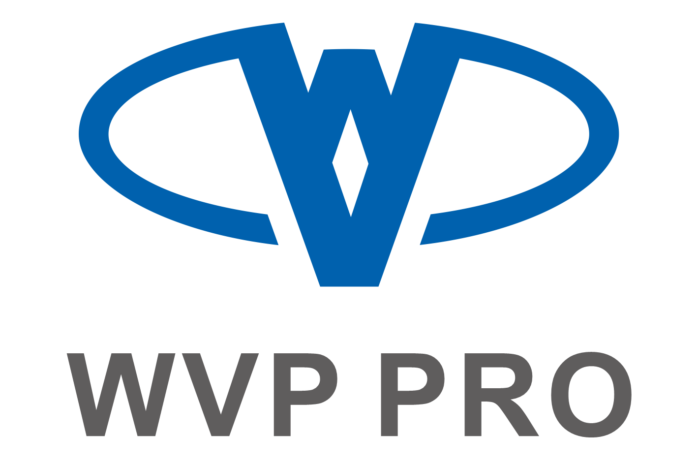
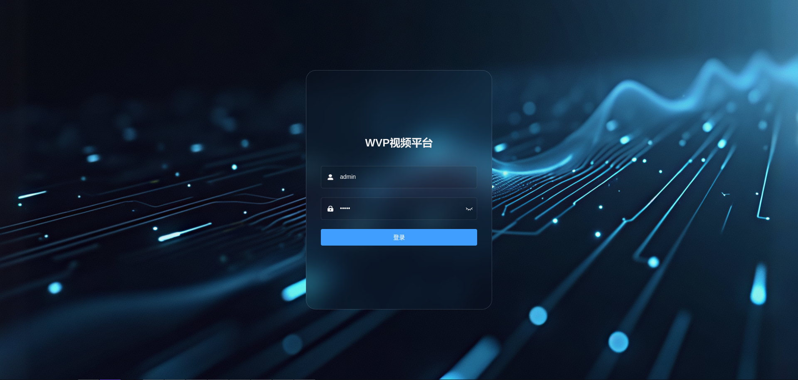
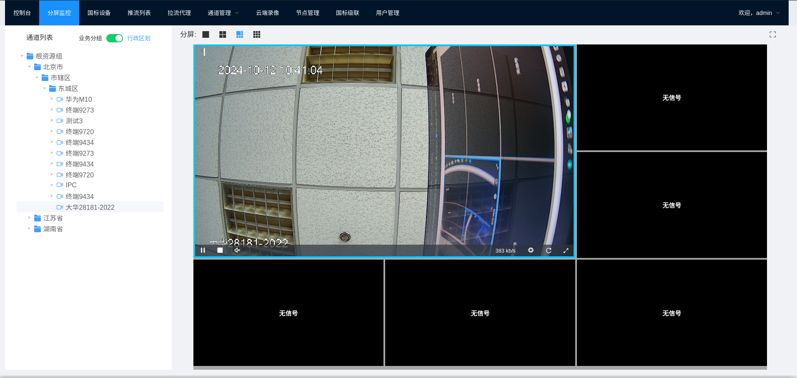
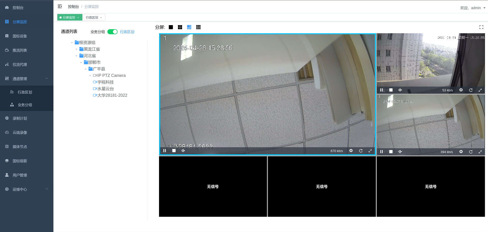
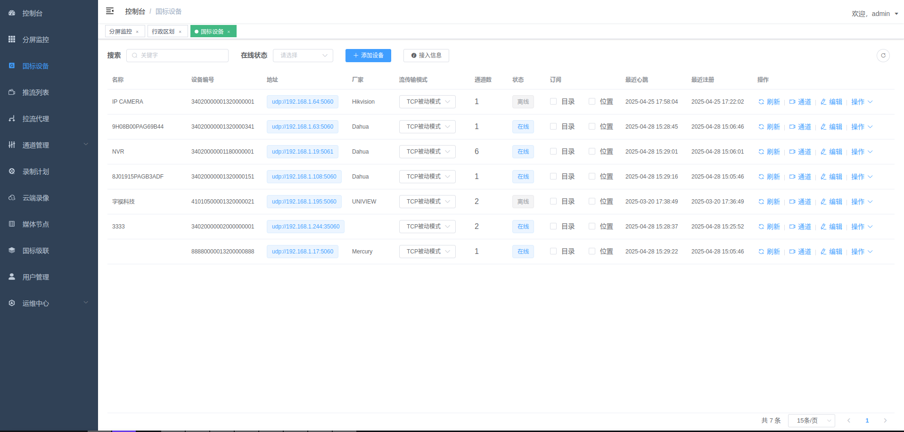
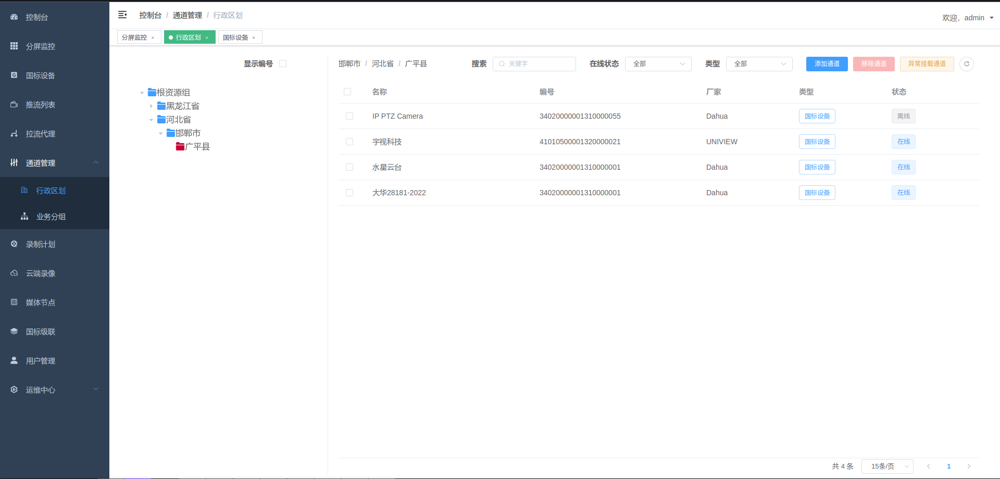
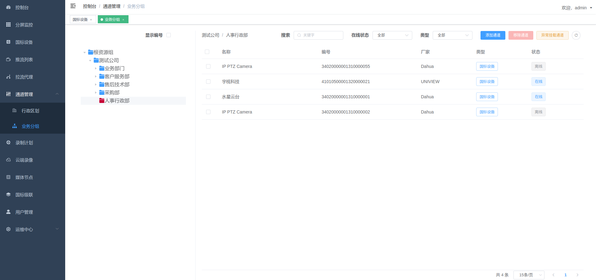
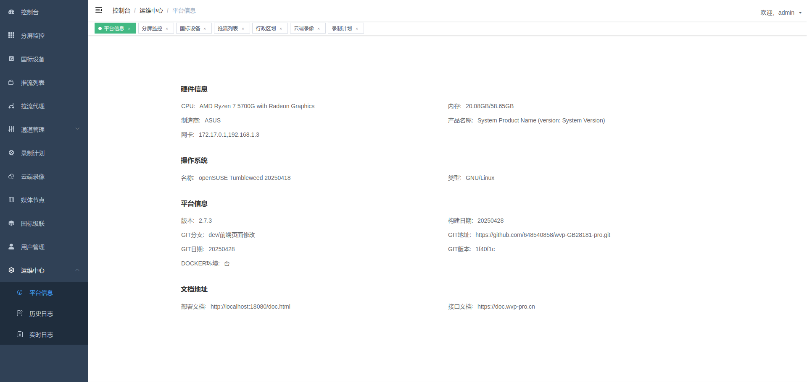

# 开箱即用的28181协议视频平台

WEB VIDEO PLATFORM是一个基于GB28181-2016标准实现的开箱即用的网络视频平台，负责实现核心信令与设备管理后台部分，支持NAT穿透，支持海康、大华、宇视等品牌的IPC、NVR接入。支持国标级联，支持将不带国标功能的摄像机/直播流/直播推流转发到其他国标平台。

流媒体服务基于@夏楚 ZLMediaKit [https://github.com/ZLMediaKit/ZLMediaKit](https://github.com/ZLMediaKit/ZLMediaKit)   
播放器使用@dexter jessibuca [https://github.com/langhuihui/jessibuca/tree/v3](https://github.com/langhuihui/jessibuca/tree/v3)  
播放器使用@Numberwolf-Yanlong h265web.js [https://github.com/numberwolf/h265web.js](https://github.com/numberwolf/h265web.js)  
前端页面基于vue-admin-template构建 [https://github.com/PanJiaChen/vue-admin-template?tab=readme-ov-file](https://github.com/PanJiaChen/vue-admin-template?tab=readme-ov-file)  

# 应用场景：
支持浏览器无插件播放摄像头视频。
支持国标设备(摄像机、平台、NVR等)设备接入
支持rtsp, rtmp，直播设备设备接入，充分利旧。
支持国标级联。多平台级联。跨网视频预览。
支持跨网网闸平台互联。

# 文档
wvp使用文档 [https://doc.wvp-pro.cn](https://doc.wvp-pro.cn)  
ZLM使用文档 [https://github.com/ZLMediaKit/ZLMediaKit](https://github.com/ZLMediaKit/ZLMediaKit)

# 付费社群

> 收费是为了提供更好的服务，也是对作者更大的激励。加入星球的用户三天后可以私信我留下微信号，我会拉大家入群。加入三天内不满意可以直接自行推出,星球会直接退款给大家。

> 星球还提供了包括闭源的全功能试用包, 会随时更新。

# gitee仓库
https://gitee.com/pan648540858/wvp-GB28181-pro.git

# 截图
<table>
    <tr>
        <td >
登录页面 
</td>
        <td >
首页
</td>
    </tr>
    <tr>
        <td >
分屏播放 
</td>
        <td >
国标设备列表
</td>
    </tr>
    <tr>
        <td >
行政区划管理 
</td>
        <td >
业务分组管理
</td>
    </tr>
    <tr>
        <td >
录制计划
</td>
        <td >
平台信息
</td>
    </tr>
</table>

# 功能特性
- [X] 集成web界面
- [X] 兼容性良好
- [X] 跨平台服务，一次编译多端部署， 可以同时用于x86和arm架构
- [X] 接入设备
  - [X] 视频预览
  - [X] 支持主码流子码流切换
  - [X] 无限制接入路数，能接入多少设备只取决于你的服务器性能
  - [X] 云台控制，控制设备转向，拉近，拉远
  - [X] 预置位查询，使用与设置
  - [X] 查询NVR/IPC上的录像与播放，支持指定时间播放与下载
  - [X] 无人观看自动断流，节省流量
  - [X] 视频设备信息同步
  - [X] 离在线监控
  - [X] 支持直接输出RTSP、RTMP、HTTP-FLV、Websocket-FLV、HLS多种协议流地址
  - [X] 支持通过一个流地址直接观看摄像头，无需登录以及调用任何接口
  - [X] 支持UDP和TCP两种国标信令传输模式
  - [X] 支持UDP和TCP两种国标流传输模式
  - [X] 支持检索,通道筛选
  - [X] 支持通道子目录查询
  - [X] 支持过滤音频，防止杂音影响观看
  - [X] 支持国标网络校时
  - [X] 支持播放H264和H265
  - [X] 报警信息处理，支持向前端推送报警信息
  - [X] 语音对讲
  - [X] 支持业务分组和行政区划树自定义展示以及级联推送
  - [X] 支持订阅与通知方法
    - [X] 移动位置订阅
    - [X] 移动位置通知处理
    - [X] 报警事件订阅
    - [X] 报警事件通知处理
    - [X] 设备目录订阅
    - [X] 设备目录通知处理
  -  [X] 移动位置查询和显示
  - [X] 支持手动添加设备和给设备设置单独的密码
-  [X] 支持平台对接接入
-  [X] 支持国标级联
  - [X] 国标通道向上级联
    - [X] WEB添加上级平台
    - [X] 注册
    - [X] 心跳保活
    - [X] 通道选择
    - [X] 支持通道编号自定义, 支持每个平台使用不同的通道编号
    - [X] 通道推送
    - [X] 点播
    - [X] 云台控制
    - [X] 平台状态查询
    - [X] 平台信息查询
    - [X] 平台远程启动
    - [X] 每个级联平台可自定义的虚拟目录
    - [X] 目录订阅与通知
    - [X] 录像查看与播放
    - [X] GPS订阅与通知（直播推流）
    - [X] 语音对讲
  - [X] 支持同时级联到多个上级平台
- [X] 支持自动配置ZLM媒体服务, 减少因配置问题所出现的问题;
- [X] 支持流媒体节点集群，负载均衡。
- [X] 支持启用udp多端口模式, 提高udp模式下媒体传输性能;
- [X] 支持公网部署；
- [X] 支持wvp与zlm分开部署，提升平台并发能力
- [X] 支持拉流RTSP/RTMP，分发为各种流格式，或者推送到其他国标平台
- [X] 支持推流RTSP/RTMP，分发为各种流格式，或者推送到其他国标平台
- [X] 支持推流鉴权
- [X] 支持接口鉴权
- [X] 云端录像，推流/代理/国标视频均可以录制在云端服务器，支持预览和下载
- [X] 支持打包可执行jar和war
- [X] 支持跨域请求，支持前后端分离部署
- [X] 支持Mysql，Postgresql，金仓等数据库
- [X] 支持录制计划, 根据设定的时间对通道进行录制. 暂不支持将录制的内容转发到国标上级
- [X] 支持国标信令集群

# 闭源内容
- [X] 支持ONVIF协议，设备检索，支持点播，云台控制，国标级联点播，自动点播等。
- [X] 支持部标1078+808协议，支持点播，云台控制，录像回放，位置上报，自动点播等。
- [X] 支持国标28181-2022协议，支持巡航轨迹查询，PTZ精准控制，存储卡格式化，设备软件升级，OSD配置，h265+aac，支持辅码流，录像倒放等。

# 授权协议
本项目自有代码使用宽松的MIT协议，在保留版权信息的情况下可以自由应用于各自商用、非商业的项目。 但是本项目也零碎的使用了一些其他的开源代码，在商用的情况下请自行替代或剔除； 由于使用本项目而产生的商业纠纷或侵权行为一概与本项目及开发者无关，请自行承担法律风险。 在使用本项目代码时，也应该在授权协议中同时表明本项目依赖的第三方库的协议

# 技术支持

[知识星球](https://t.zsxq.com/0d8VAD3Dm)专栏列表：，
- [使用入门系列一：WVP-PRO能做什么](https://t.zsxq.com/0dLguVoSp)

有偿技术支持，一对一开发辅导，闭源内容合作请发送邮件到648540858@qq.com咨询

# 致谢
感谢作者[夏楚](https://github.com/xia-chu) 提供这么棒的开源流媒体服务框架,并在开发过程中给予支持与帮助。     
感谢作者[dexter langhuihui](https://github.com/langhuihui)和[Numberwolf-Yanlong](https://github.com/numberwolf/h265web.js) 开源这么好用的WEB播放器。      
感谢各位大佬的赞助以及对项目的指正与帮助。包括但不限于代码贡献、问题反馈、资金捐赠等各种方式的支持！以下排名不分先后：  
[lawrencehj](https://github.com/lawrencehj) [Smallwhitepig](https://github.com/Smallwhitepig) [swwhaha](https://github.com/swwheihei)
[hotcoffie](https://github.com/hotcoffie) [xiaomu](https://github.com/nikmu) [TristingChen](https://github.com/TristingChen)
[chenparty](https://github.com/chenparty) [Hotleave](https://github.com/hotleave) [ydwxb](https://github.com/ydwxb)
[ydpd](https://github.com/ydpd) [szy833](https://github.com/szy833) [ydwxb](https://github.com/ydwxb) [Albertzhu666](https://github.com/Albertzhu666)
[mk1990](https://github.com/mk1990) [SaltFish001](https://github.com/SaltFish001)
