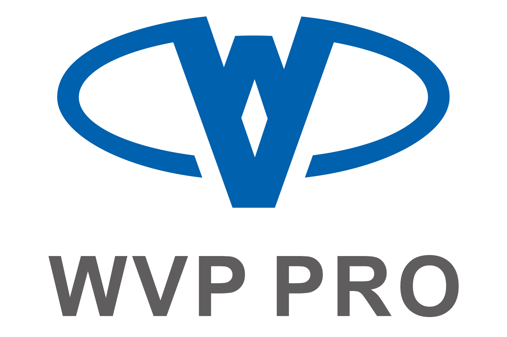
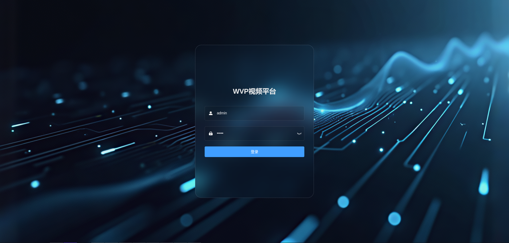
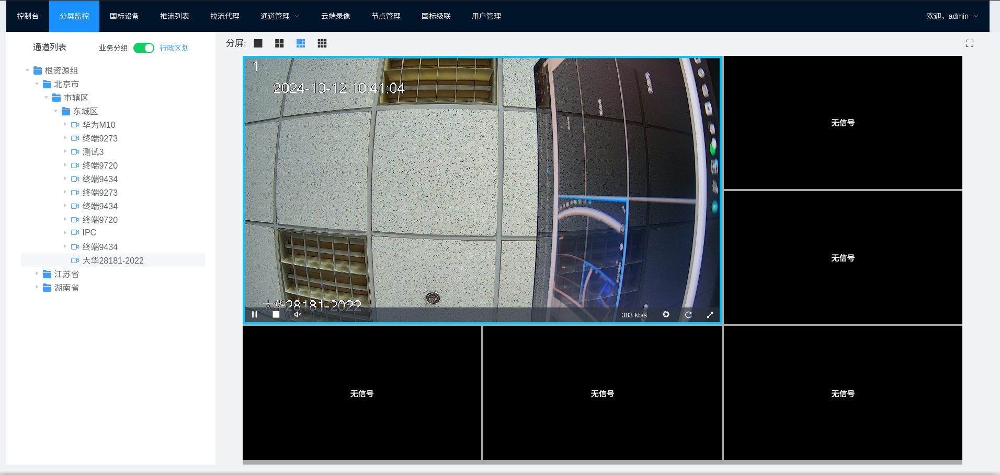
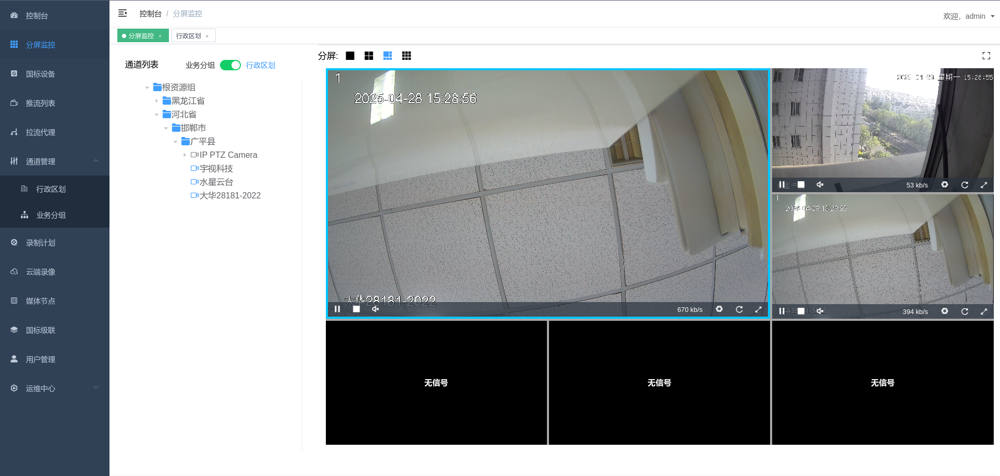
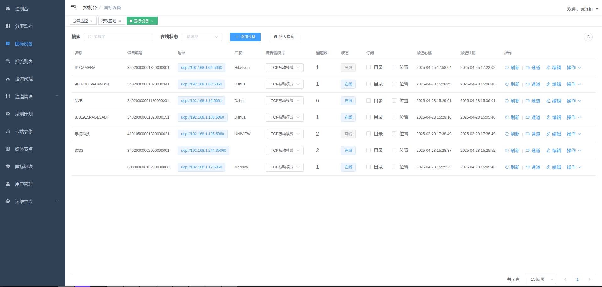
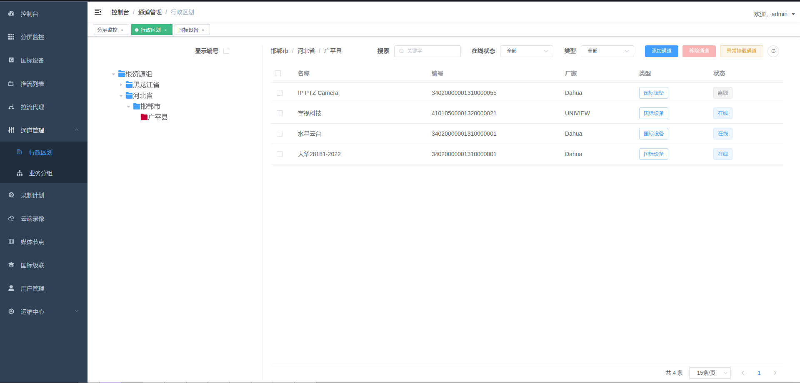
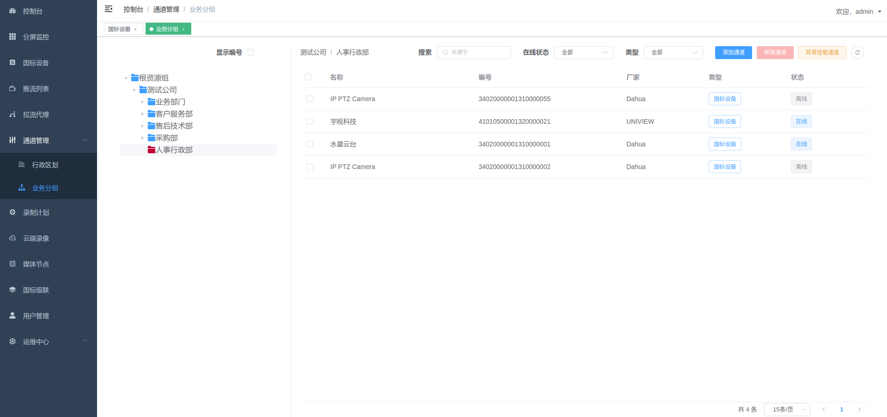
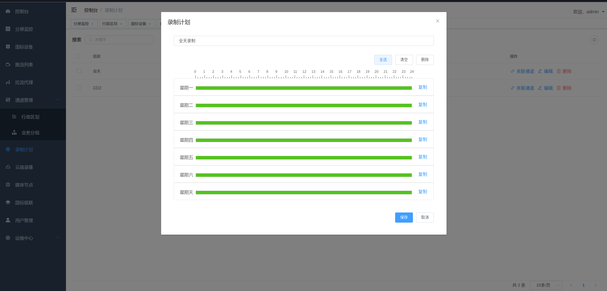
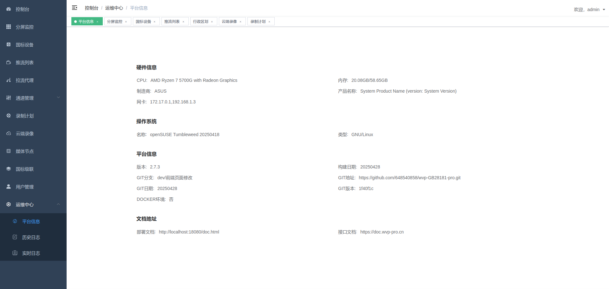

# An out-of-the-box video platform for the GB28181 and JT/T 808 + JT/T 1078 protocols

WEB VIDEO PLATFORM is an out-of-the-box network video platform implementing the GB28181-2016, JT/T 808 and JT/T 1078 standards. It provides the core signaling and the device management backend, supports NAT traversal, and supports connecting IPCs and NVRs from brands such as Hikvision, Dahua and Uniview. It supports GB cascading, and can forward cameras, live streams and pushed live streams that have no GB capability of their own to other GB platforms.

The media service is based on ZLMediaKit by @夏楚 (xia-chu) [https://github.com/ZLMediaKit/ZLMediaKit](https://github.com/ZLMediaKit/ZLMediaKit)   
The player uses jessibuca by @dexter [https://github.com/langhuihui/jessibuca/tree/v3](https://github.com/langhuihui/jessibuca/tree/v3)  
The player uses h265web.js by @Numberwolf-Yanlong [https://github.com/numberwolf/h265web.js](https://github.com/numberwolf/h265web.js)  
The frontend pages are built on vue-admin-template [https://github.com/PanJiaChen/vue-admin-template?tab=readme-ov-file](https://github.com/PanJiaChen/vue-admin-template?tab=readme-ov-file)  

# Use cases:
- Plugin-free playback of camera video in the browser.
- Connection of GB-compliant devices (cameras, platforms, NVRs, etc.).
- Connection of RTSP, RTMP and live-streaming devices, making full use of legacy equipment.
- GB cascading, multi-platform cascading, and cross-network video preview.
- Interconnection of platforms across network gateways (air gaps).

# Documentation
WVP documentation [https://doc.wvp-pro.cn](https://doc.wvp-pro.cn)  
ZLM documentation [https://github.com/ZLMediaKit/ZLMediaKit](https://github.com/ZLMediaKit/ZLMediaKit)

# Gitee repository
https://gitee.com/pan648540858/wvp-GB28181-pro.git

# Screenshots
<table>
    <tr>
        <td >
Login page 
</td>
        <td >
Home page
</td>
    </tr>
    <tr>
        <td >
Split-screen playback 
</td>
        <td >
GB device list
</td>
    </tr>
    <tr>
        <td >
Administrative division management 
</td>
        <td >
Business group management
</td>
    </tr>
    <tr>
        <td >
Recording schedules
</td>
        <td >
Platform information
</td>
    </tr>
</table>

# Features
- [X] Integrated web interface
- [X] Good compatibility
- [X] Cross-platform service: compile once, deploy anywhere; runs on both x86 and ARM architectures
- [X] Device connectivity
  - [X] Video preview
  - [X] Switching between main and sub streams
  - [X] No limit on the number of connected streams; how many devices you can connect depends only on your server's performance
  - [X] PTZ control: pan/tilt, zoom in and zoom out
  - [X] Preset queries, use and configuration
  - [X] Query and playback of recordings stored on the NVR/IPC, with playback and download for a given time range
  - [X] Automatic stream shutdown when nobody is watching, saving bandwidth
  - [X] Video device information synchronization
  - [X] Online/offline monitoring
  - [X] Direct output of RTSP, RTMP, HTTP-FLV, WebSocket-FLV and HLS stream addresses
  - [X] Watch a camera directly through a single stream address, with no login and no API calls required
  - [X] Both UDP and TCP GB signaling transport modes
  - [X] Both UDP and TCP GB stream transport modes
  - [X] Search and channel filtering
  - [X] Channel subdirectory queries
  - [X] Audio filtering, to prevent noise from disturbing playback
  - [X] GB network time synchronization
  - [X] H.264 and H.265 playback
  - [X] Alarm message handling, including pushing alarm messages to the frontend
  - [X] Voice intercom
  - [X] Custom display of business group and administrative division trees, plus cascade pushing
  - [X] Subscription and notification methods
    - [X] Mobile position subscription
    - [X] Mobile position notification handling
    - [X] Alarm event subscription
    - [X] Alarm event notification handling
    - [X] Device catalog subscription
    - [X] Device catalog notification handling
  -  [X] Mobile position query and display
  - [X] Manually adding devices and assigning an individual password to a device
-  [X] Platform-to-platform integration
-  [X] GB cascading
  - [X] Cascading GB channels to an upper-level platform
    - [X] Adding an upper-level platform from the web UI
    - [X] Registration
    - [X] Heartbeat keep-alive
    - [X] Channel selection
    - [X] Custom channel numbering, with different channel numbers per platform
    - [X] Channel pushing
    - [X] On-demand playback
    - [X] PTZ control
    - [X] Platform status query
    - [X] Platform information query
    - [X] Remote platform startup
    - [X] A customizable virtual catalog for each cascaded platform
    - [X] Catalog subscription and notification
    - [X] Recording viewing and playback
    - [X] GPS subscription and notification (live stream pushing)
    - [X] Voice intercom
  - [X] Cascading to several upper-level platforms at the same time
- [X] Automatic configuration of the ZLM media server, reducing problems caused by misconfiguration
- [X] Media node clustering with load balancing
- [X] Optional UDP multi-port mode, improving media transport performance in UDP mode
- [X] Public-network deployment
- [X] Deploying WVP and ZLM separately, increasing the platform's concurrency
- [X] Pulling RTSP/RTMP streams and redistributing them in various stream formats, or pushing them to other GB platforms
- [X] Publishing RTSP/RTMP streams and redistributing them in various stream formats, or pushing them to other GB platforms
- [X] Publishing authentication
- [X] API authentication
- [X] Cloud recording: pushed, proxied and GB video can all be recorded on a cloud server, with preview and download support
- [X] Packaging as an executable JAR or as a WAR
- [X] Cross-origin requests, allowing separate frontend/backend deployment
- [X] MySQL, PostgreSQL, KingbaseES and other databases
- [X] Recording schedules, recording channels according to the configured times. Forwarding recorded content to a GB upper-level platform is not supported yet.
- [X] GB signaling clustering
- [X] Newly added support for JT/T 808 and JT/T 1078, with many new features not listed individually. Can act as a gateway so that JT/T devices can be called by a GB upper-level platform.
- [X] Electronic maps. Channel positions can be displayed and edited on the map. Layered data thinning is supported, so even millions of records display smoothly. Standard vector tile layers are provided and can be rendered directly by common map engines.
- [X] Leveraging new capabilities of the closed-source ZLM build, recordings can be stored in S3 storage, including MinIO.
- [X] **Brand-new virtual thread support, greatly increasing the platform's concurrency. LAN stress tests easily handle 50,000+ connected devices — and that is not the service's limit, it is the limit of my stress-testing tool and test hardware; feel free to test it yourself. Real-world performance depends on server performance and network bandwidth.**
- [X] **Alarm subscription and alarm management, with display and querying of alarm events, and automatic snapshot capture and recording playback when an alarm occurs.**

# Closed-source content
  - [X] Includes all open-source features
  - [X] GB28181-2022 protocol support, already certified
    - [X] Explicit support for H.265 video encoding and AAC audio encoding (already supported in the open-source version)
    - [X] Main/sub stream switching (already supported in the open-source version)
    - [X] GB18030 encoding support — previously GB2312 often produced garbled text for characters it did not cover; this no longer happens
    - [X] Image snapshots: the device takes the snapshot itself and uploads it to the server, which is fast and saves bandwidth
    - [X] Precise PTZ control: control, query and position-change subscription, with precise setting of pan angle, tilt angle and zoom factor
    - [X] OSD configuration
    - [X] Video privacy-mask configuration
    - [X] Cruise track queries and a complete cruise feature (adds read-back on top of the open-source version)
    - [X] Storage card management, with status query and formatting
    - [X] Device firmware upgrade
    - [X] Target tracking, with manual tracking by selecting a region directly in the web page, as well as automatic tracking
    - [X] Remote configuration of the device's own recording schedule
    - [X] Alarm recording configuration
    - [X] Alarm reporting switch
    - [X] Video parameter configuration: encoding format, resolution, frame rate, bitrate, and the video bitrate value (required in constant-bitrate mode)
    - [X] Image flip control: set as the reference image, horizontal mirroring (left-right flip), vertical mirroring (up-down flip) and center mirroring (flipped both ways)
    - [X] Querying home-position (guard position) information (adds read-back on top of the open-source version)
    - [X] Reverse playback of recordings, including reverse seeking
    - [X] Simultaneous GB28181-2022 and GB28181-2016 cascading, with your choice of version
  - [X] ONVIF protocol
    - In-house protocol implementation: secure and reliable.
    - Device discovery
    - Real-time image preview
    - Recording playback with playback speed control
    - PTZ control (eight directions), preset control, absolute positioning, home position, focus control
    - Focus control
    - Device reboot
    - Device time configuration and comparison of the offset against system time
    - Factory reset
    - Automatic retrieval of device brand and other information, DNS information display, protocol display
    - GB cascaded on-demand playback, automatic on-demand playback, etc.
  - [X] **Hikvision ISUP 5.0 / ISUP 4.0 / ISUP 2.0 / EHome**
    - Device registration
    - Resource retrieval
    - Preview
    - Recording query and playback
    - PTZ control
    - Preset control
    - Alarms, with parsing and display of many alarm types:
      - Tripwire detection
      - Region intrusion
      - Motion detection
      - Wrong-way detection
      - Loitering detection
      - Crowd gathering
      - Audio anomaly
      - Device faults, etc.
    - Snapshots (the device uploads the snapshot image directly to the server, using little bandwidth and requiring no server-side stream pulling or decoding)
    - Intercom support
    - Device configuration (device name, loop recording and other settings)
    - Device information (serial number, type, etc.)
    - Version information (software, encoder, panel and hardware version numbers)
    - Encoding configuration (main/sub stream resolution, bitrate, frame rate and other settings)
    - Image parameter configuration (hue, contrast, brightness and saturation)
  - [X] Dahua SDK
    - LAN device discovery
    - Active device registration (for when the server is deployed on the public network)
    - Channel retrieval
    - Preview
    - Recording playback
    - Recording download
    - PTZ control, including preset control, cruise groups, patterns, horizontal rotation, PTZ speed configuration, power-up action, idle action, PTZ limits, scheduled tasks and PTZ reboot
    - Snapshots (the device uploads the snapshot image directly to the server, using little bandwidth and requiring no server-side stream pulling or decoding)
    - Broadcast (simplex) and intercom (duplex)
    - Camera configuration, including brightness, contrast, saturation, color suppression, gamma, sharpness and sharpness suppression; view configuration with normal, flipped, corridor and mirror modes; and configuration of exposure, backlight, white balance, day/night mode, digital zoom, focus, fill light and defog
    - Alarm reception
  - [ ] GB35114 protocol (in development...)
  - [X] State Grid B-interface protocol
    - Device registration
    - Resource retrieval
    - Preview
    - PTZ control
    - Preset control, etc.
    - Voice intercom, recording playback and image snapshots can be customized free of charge.
  - [X] Assigning usable channels per permission
  - [X] Table export
  - [X] Stream proxying with URL composition based on brand
  - [X] Playback authentication: unauthorized devices cannot be played, even if the playback address is known

# License
This project's own code uses the permissive MIT license and, provided the copyright notice is retained, may be freely used in both commercial and non-commercial projects. However, the project also uses small pieces of other open-source code, which you should replace or remove yourself for commercial use. Any commercial disputes or infringements arising from the use of this project are unrelated to the project and its developers; you assume the legal risk yourself. When using this project's code you should also state the licenses of the third-party libraries it depends on in your own license terms.

# Technical support

## Official WeChat official account

> Provides the latest WVP development progress, roadmap and other content. You are welcome to follow it.

## Paid community

> The paid community both supports the author and helps everyone solve problems faster; it also gives users who formally join the group access to a WeChat group. If you are not satisfied with the content, leaving within three days qualifies for an automatic refund. If you cannot join for now, giving the project a star is also a great encouragement.

[Zhishixingqiu (ZSXQ)](https://t.zsxq.com/0d8VAD3Dm) column list:
- [WVP deployment security hardening guide: a must-read for beginners on defending against attacks and vulnerabilities](https://articles.zsxq.com/id_tv8wz4uubx2n.html)

For paid technical support, one-on-one development coaching, or closed-source content cooperation, please send an email to 648540858@qq.com.

# Acknowledgements
Thanks to [夏楚 (xia-chu)](https://github.com/xia-chu) for providing such an excellent open-source media streaming framework, and for the support and help given during development.     
Thanks to [dexter langhuihui](https://github.com/langhuihui) and [Numberwolf-Yanlong](https://github.com/numberwolf/h265web.js) for open-sourcing such useful web players.      
Thanks to everyone for their sponsorship and for correcting and helping the project — including but not limited to code contributions, issue reports, financial donations and every other kind of support! The list below is in no particular order:  
[lawrencehj](https://github.com/lawrencehj) [Smallwhitepig](https://github.com/Smallwhitepig) [swwhaha](https://github.com/swwheihei)
[hotcoffie](https://github.com/hotcoffie) [xiaomu](https://github.com/nikmu) [TristingChen](https://github.com/TristingChen)
[chenparty](https://github.com/chenparty) [Hotleave](https://github.com/hotleave) [ydwxb](https://github.com/ydwxb)
[ydpd](https://github.com/ydpd) [szy833](https://github.com/szy833) [ydwxb](https://github.com/ydwxb) [Albertzhu666](https://github.com/Albertzhu666)
[mk1990](https://github.com/mk1990) [SaltFish001](https://github.com/SaltFish001)
