<!-- 国标级联的使用 -->
# 国标级联的使用
国标28181不同平台之间支持两种连接方式，平级和上下级，WVP目前支持向上级级联。
## 1 接入平台
### 1.1 wvp-pro
#### 1.1.1 wvp-pro管理页面点击添加
   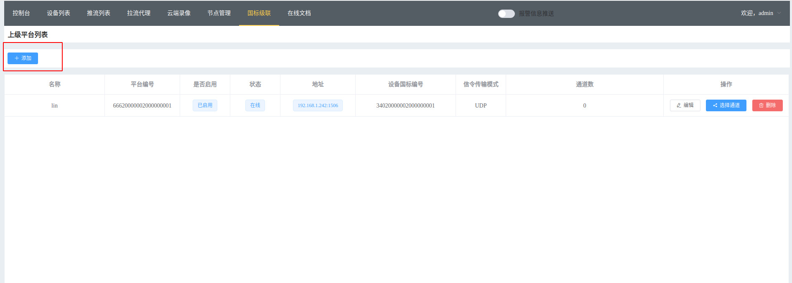
#### 1.1.2 填入wvp-pro上级平台信息
   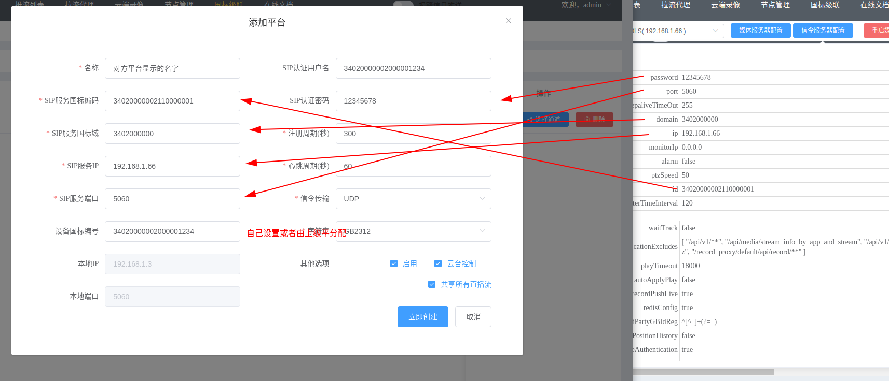
   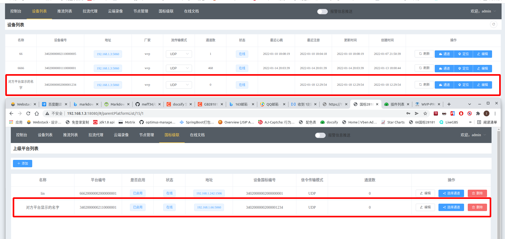
#### 1.1.3 编辑wvp-pro上级设备信息，开启订阅
   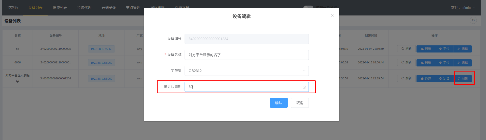
### 1.2 大华平台
### 1.3 海康平台
### 1.4 liveGBS
#### 1.4.1. wvp-pro管理页面点击添加  
   
#### 1.4.2. 填入liveGBS平台信息  
   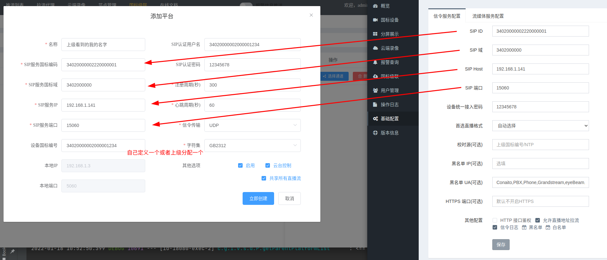
   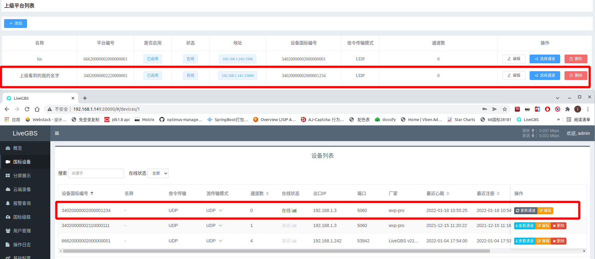
#### 1.4.3. 编辑liveGBS设备信息，开启目录订阅  
   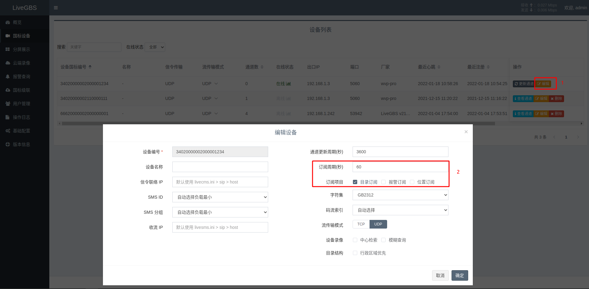  
#### 1.4.4. 编辑liveGBS设备信息，开启GPS订阅  
   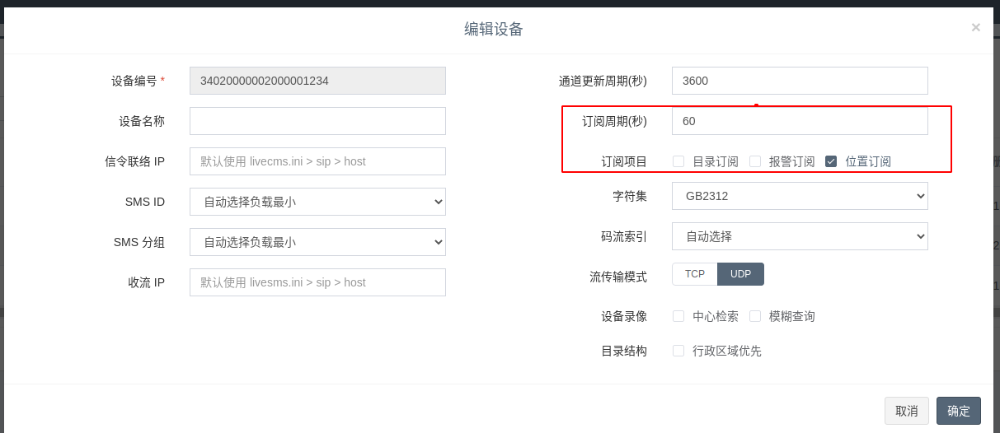

## 2 添加目录与通道
1. 级联平台添加目录信息  
   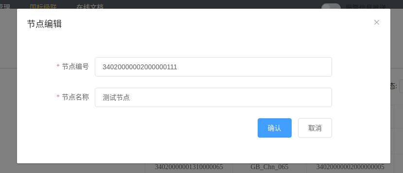
2. 为目录添加通道  
   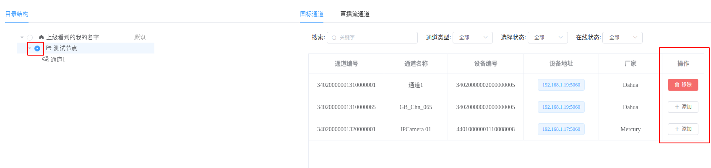
3. 设置默认流目录   
如果需要后续自动生成的流信息都在某一个节点下，可以在对应节点右键设置为默认  
   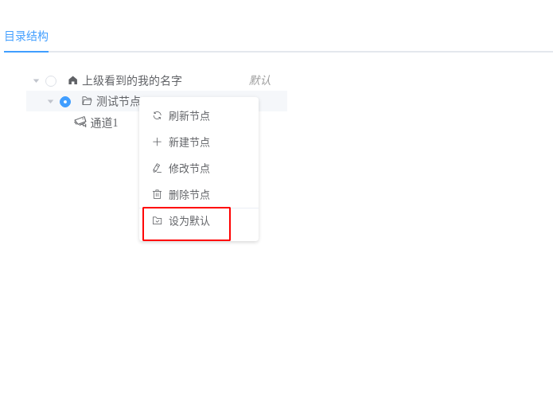

