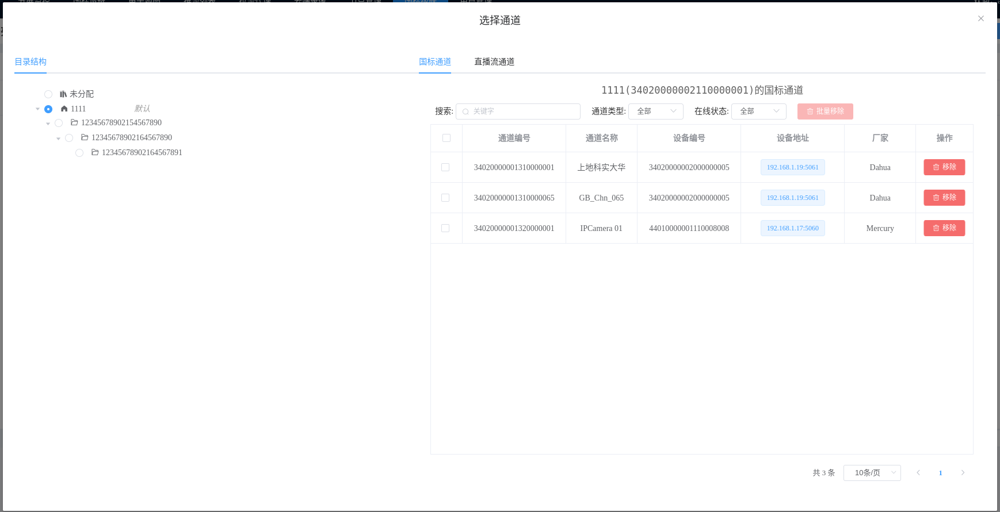

<!-- 国标级联的使用 -->
# 国标级联的使用
国标28181不同平台之间支持两种连接方式，平级和上下级，WVP目前支持向上级级联。
## 添加上级平台
在国标级联页面点击“添加”按钮，以推送到上级WVP为例子，参看[接入设备](./_content/ability/device.md)

点击保存可以在上级的国标通道列表看到新增加的设备；
国标级联列表出现了级联的这个平台；同时状态显示为在线，如果状态为离线那么可能是你的服务信息配置有误或者网络不通。
订阅信息列有三个图标，表示上级开启订阅，从左到右依次是：报警订阅，目录订阅，移动位置订阅。
## 推送通道
点击你要推送的平台的“选择通道”按钮。

- **页面结构**
  - 左侧为目录结构  
  选择未分配，则右侧显示待分配的通道，可以点击“添加按钮”，在弹窗中选择要放置的位置，保存后即可添加通道成功
  选择其他的目录可以看到已经分配在这个目录下的通道，可以对其进行删除后重新在未分配中去分配。
  - 右侧为数据展示以及操作  
  国标通道栏内为来自其他国标设备/平台的通道；直播流通道为来自推流/拉流代理的通道。