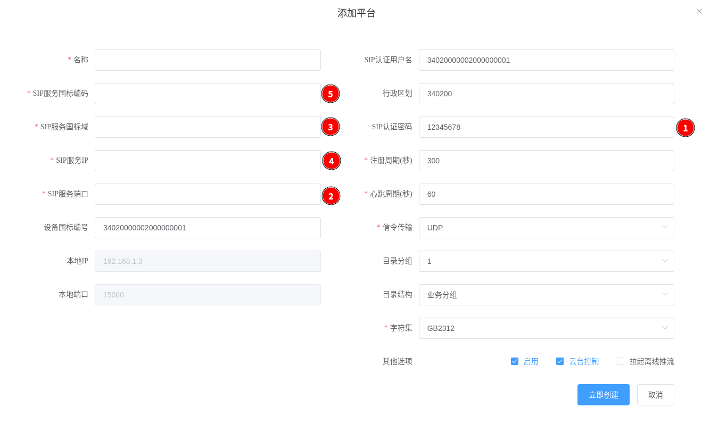

<!-- 国标级联的使用 -->

# 国标级联的使用

国标28181不同平台之间支持两种连接方式，平级和上下级，WVP目前支持向上级级联。

## 添加上级平台

在国标级联页面点击“添加”按钮，以推送到上级WVP为例子，参看[接入设备](./_content/ability/device.md)

1. 名称  
   上级平台看到的下级平台名称;
2. 本地IP  
   本地连接上级使用的具体哪个网卡;
3. SIP认证用户名  
   可以设置为与"设备国标编号"一致;
4. 注册周期  
   间隔多久发起一次注册,单位秒;
5. 心跳周期  
   间隔多久发送一次心跳,一般上级平台三次收不到心跳就会认为下级离线了, 所以建议{心跳周期}x3 < 注册周期;
6. SDP发流IP  
   调用媒体节点发送视频流给上级时,使用的本地IP;
7. 信令传输  
   信令传输模式,支持udp和TCP,没有特殊需求,默认UDP即可;
8. 目录分组  
   上级发送"CATALOG"消息查询通道信息,每一条消息中携带几条通道信息,默认为1,增大该值,可以加快通道发送速度;
9. 字符集  
   发送给上级"MESSAGE"消息中的消息体使用的编码格式,国标28181-2016默认为GB2312;
10. 行政区划  
    如果勾选"其他选项/推送平台信息"选项,会给上级推送平台信息,这里就是平台的行政区划信息
11. 平台厂商  
    如果勾选"其他选项/推送平台信息"选项,会给上级推送平台信息,这里就是平台的平台厂商信息
12. 平台型号  
    如果勾选"其他选项/推送平台信息"选项,会给上级推送平台信息,这里就是平台的平台型号信息
13. 平台安装地址  
    如果勾选"其他选项/推送平台信息"选项,会给上级推送平台信息,这里就是平台的平台安装地址信息
14. 其他选项
    - RTCP保活  
      在上级的流传输模式为UDP时,因为UDP的无状态特性,会无法知道上级是否在正常收流,启用RTCP保活时,就可以主动发送RTCP消息确认上级是否在正常收流,
      异常情况下,可以下级主动停止发流;
    - 消息通道  
      支持通过报警消息给上级级WVP推送消息,消息内容由redis消息发送给wvp,wvp编辑成报警消息发送给上级;
    - 主动推送通道  
      WVP模拟一条目录订阅信息,然后在共享通道变化时,发送CATAOLOG事件给上级,通知具体的通道变化,  
      目前支持的状态有: 状态改变事件 ON:上线,OFF:离线,VLOST:视频丢失,DEFECT:故障,ADD:增加,DEL:删除,UPDATE:更新;
    - 推送平台信息  
      勾选此项,上级收到的通道信息中会多出一个平台信息的通道.内容在平台的编辑中修改;
    - 推送分组信息  
      勾选此项,如果你共享的通道分配了具体的业务分组以及虚拟组织,那么上级收到的通道中会包括业务分组以及虚拟组织节点信息;
    - 推送行政区划  
      勾选此项,如果你共享的通道分配了具体的行政区划,那么上级收到的通道中会包括行政区划信息;

国标级联列表出现了级联的这个平台；同时状态显示为在线，如果状态为离线那么可能是你的服务信息配置有误或者网络不通。
订阅信息列有三个图标，表示上级开启订阅，从左到右依次是：报警订阅，目录订阅，移动位置订阅。

## 通道共享

点击你要推送的平台的“通道共享”按钮。

1. 添加状态选择"未共享"可以将具体的通道共享给上级;
2. 添加状态选择"已共享"可以看到已经共享的通道,并且支持为这个通道在这个平台设备专门的名称和编号;
3. 点击"按设备添加"可以将某个国标设备下的所有通道共享给上级;
4. 点击"按设备移除"可以将某个国标设备下的所有通道取消共享给上级;
5. 点击"全部添加"可以将所有通道共享给上级；
6. 点击"全部移除"可以将所有通道共享给上级；

## 推送通道

WVP会将所有通道信息按照目录订阅消息通知形式,发送ADD事件给上级.