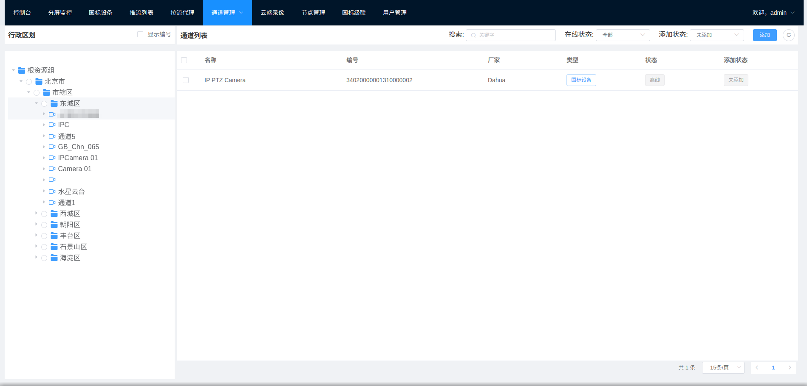
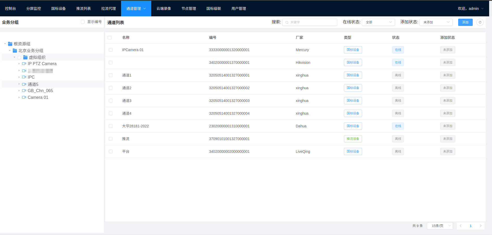

# 通道管理

通道管理为了对已经分配国标编号的通道进行统一的行政区划和业务分组管理,国标中对于组织结构有两种表示方式,一种是按照行政区划,一种是业务分组+虚拟组织的方式.
行政区划结构固定,比如: 北京/市辖区/昌平区, 通道可以挂载道何一级行政区划下. 业务分组比较灵活, 可以按照自己的随意取名,
但是通道只能放在业务分组下的虚拟组织里,不能放在业务分组下.

## 行政区划

左侧树结构为行政区划结构, 通过数据鼠标右键可以操作,包括: 刷新节点,新建节点,编辑节点,删除节点,添加设备(
可以将某个国标设备下的通道全部添加道某一个节点下),移除设备(可以将某个国标设备下的通道全部从这个节点移除)
右侧伪通道列表, 对于非国标接入的设备只有配置了国标编号后才可以在这里进行操作。  
选择左侧的节点后，可以点击右侧的“添加通道”， 选择需要的通道添加到改节点下，如果找不到通道， 可以选择“异常挂载通道”，点击清理后重新回来选择。

## 业务分组

左侧树结构为业务分组结构, 通过数据鼠标右键可以操作,包括: 刷新节点,新建节点,编辑节点,删除节点,添加设备(
可以将某个国标设备下的通道全部添加道某一个节点下),移除设备(可以将某个国标设备下的通道全部从这个节点移除)
业务分组下不能挂载设备,所以没有选择该节点的单选框.
右侧为通道列表, 对于非国标接入的设备只有配置了国标编号后才可以在这里进行操作。  

选择左侧的节点后，可以点击右侧的“添加通道”， 选择需要的通道添加到改节点下。  
如果找不到通道， 可以选择“异常挂载通道”，点击清理后重新回来选择。  
注意，根资源组下的那一级为业务分组类型不可以直接挂载设备，需要继续建立节点，后续的节点的都是虚拟组织类型， 就可以挂载通道了。

