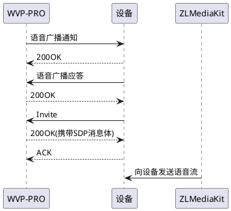
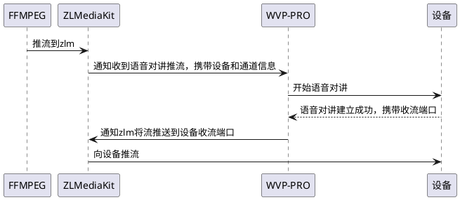

# 语音对讲
## 流程和原理
语音对讲在国标28181-2016中分为broadcast（广播）和talk（对讲）两种模式，broadcast模式是从服务端把音频传送到设备端，是单向的，
需要结合点播视频来实现双向对讲，talk模式支持双向，不过wvp只处理了和broadcast一样的把音频传递设备，这样两种模式可以使用一样的逻辑处理即可。
不同的设备对于两种模式的支持不同且通常差异很大，不同的设备对同一个设备的支持也有一些不同，所以语音对讲中的兼容和适配也是问题最多的。talk模式因为在国标28181-2022中已经移除，所以这里不再讨论它了。
### 1. broadcast模式流程

与点播的流程不同的是，这里的invite消息是由设备发送给wvp的，wvp按照invite协商的方式给设备推送语音流，所有对讲的使用那种方式（UDP/TCP被动/TCP主动）传输语音流由设备决定
## 使用条件与限制
因为invite消息是由设备发送给wvp的，这决定了发送语音流的方式，这也就决定了有的设备不能用于公网对讲，比如大部分的海康设备只支持udp方式收流(目前新版的海康设备已经在着手解决这个问题)，那么wvp发流时只能按照sdp中指定的ip端口发流，所以如果wvp在公网，设备在内网中，那么wvp无法连接设备提供的IP，发流也就失败了。
与海康不同的，大华以及很多执法记录仪厂商是支持tcp主动方式取流的，这样是可以实现公网对讲的。


## 使用ffmpeg快速测试
由于浏览器对于音频的采集需要网页支持https才可以，所以如果想要实现网页音频对讲，那么你必须给wvp和zlm配置证书以使用https。
测试阶段如果只是想测试功能可以用ffmpeg来模拟语音流，推送到wvp后可以实现把音频文件推送到摄像头。
测试命令格式如下：
```shell
ffmpeg -re -i {音频文件} -acodec pcm_alaw -ar 8000 -ac 1 -f rtsp 'rtsp://{zlm的IP}:{zlm的RTSP端口}/broadcast/{设备国标编号}_{通道国标编号}?sign={md5(pushKey)}' 
```
例如
```shell
ffmpeg -re -i test.mp3 -acodec pcm_alaw -ar 8000 -ac 1 -f rtsp 'rtsp://192.168.1.3:22554/broadcast/34020000001320000001_34020000001320000001?sign=41db35390ddad33f83944f44b8b75ded' 
```
测试流程如下：

如果听到设备播放你推送的音频，那么意味着调用成功，此过程推流即可需要调用任何接口
## 生产环境网页发起语音对讲
生产环境下使用语音对讲，如果是自己的客户端设备那么直接上面的ffmpeg测试方式，按照固定格式推流到zlm即可。
对于WEB程序，主要是局域网和公网的区别，两个原因：
1. 很多设备不支持公网对讲
2. 公网和局域网获取证书实现https支持的方式不同
### 公网使用
公网你可以直接使用证书厂商或者云服务器厂商提供的证书，这是很方便的。
### 局域网使用
局域网你需要为wvp和zlm生成自签名证书，这里我推荐一种生成自签名证书相对方便的方式,
此方式为linux下的一种方式。
下载证书生成工具:  
[https://github.com/FiloSottile/mkcert/releases/tag/v1.4.4](https://github.com/FiloSottile/mkcert/releases/tag/v1.4.4)
安装此工具， 进入解压的工具目录，执行
```shell
./mkcert-v1.4.4-linux-amd64 -install
```
生成pem证书
```shell
./mkcert-v1.4.4-linux-amd64 局域网IP 局域网IP2 局域网IP3
```
你会得到两文件*-key.pem和*.pem, 此文件配置到wvp后既可实现证书的加载
生成zlm使用的证书
```shell
cat *.pem *-key.pem> ./zlm.pem
```
得到的文件就是可以给zlm使用的证书
zlm下使用证书有两种方式：
1. 替换zlm下的default.pem, 即删除此文件并把zlm.pem重命名为default.pem
2. 在启动zlm的使用添加 `-s zlm.pem`