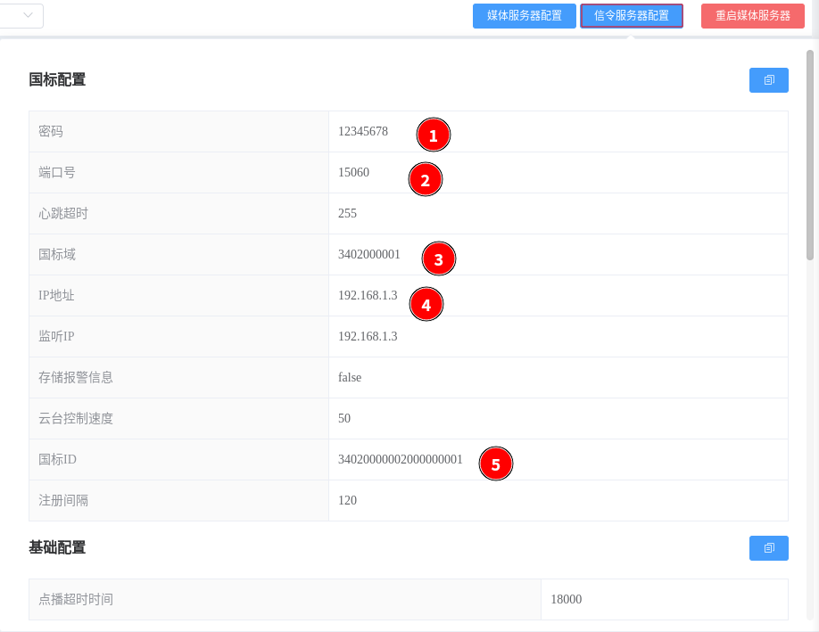

<!-- 接入设备 -->
# 接入设备
设备接入主要是需要在设备上配置28181上级也就是WVP-PRO的信息，只有信息一致的情况才可以注册成功。设备注册成功后打开WVP->国标设备,可以看到新增加的设备；[设备使用](./_content/ability/device_use.md)，  
主要有以下字段需要配置：  

- sip->ip  
本机IP，不要使用127.0.0.1/0.0.0.0, 除非你对项目及其熟悉    

- sip->port  
28181服务监听的端口  

- sip->domain  
domain宜采用ID统一编码的前十位编码。  

- sip->id  
28181服务ID

- sip->password  
28181服务密码    

- 配置信息在如下位置  

***
## 大华摄像头

## 大华NVR

## 艾科威视摄像头

## 水星摄像头

## 海康摄像头

[设备使用](_content/ability/device_use.md)
