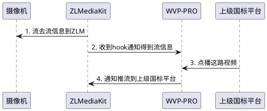

<!-- 拉流代理 -->
# 拉流代理
不是所有的摄像机都支持国标或者推流的，但是这些设备可以得到一个视频播放地址，通常为rtsp协议，
以大华为例：
```text
rtsp://{user}:{passwd}@{ipc_ip}:{rtsp_port}/cam/realmonitor?channel=1&subtype=0
```
可以得到这样一个流地址，可以直接用vlc进行播放，此时我们可以通过拉流代理功能将这个设备推送给其他国标平台了。
流程如下：

## 添加代理
拉流代理支持两种方式：
1. ZLM中直接代理流，支持RTSP/RTMP，不支持转码；
2. 借助ffmpeg完成拉转，可以通过修改ffmpeg拉转参数完成转码。  
点击页面的“添加代理”，安装提示操作即可，保存并启用成功后，可以在国标级联中[添加通道推送给上级平台](./_content/ability/cascade?id=_2-%e6%b7%bb%e5%8a%a0%e7%9b%ae%e5%bd%95%e4%b8%8e%e9%80%9a%e9%81%93)

PS： ffmpeg默认模板不需修改，需要修改参数自行去ZLM配置文件中添加一个即可。
