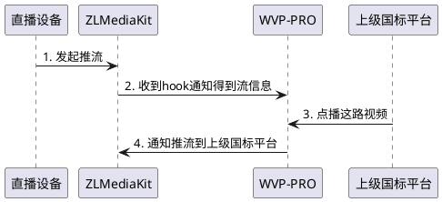

<!-- 推流列表 -->
# 推流列表
## 功能说明

WVP支持三种图像输入方式，直播，[拉流代理](_content/ability/proxy.md)，[国标](_content/ability/device.md),直播设备接入流程如下

1. 默认情况下WVP收到推流信息后，列表中出现这条推流信息，此时你可以点击“加入国标”按钮为此路推流配置名称以及国标编号，只有有国标编号的推流才可以添加到级联平台，保存成功后可以在国标级联中[添加通道推送给上级平台](_content/ability/cascade?id=_2-%e6%b7%bb%e5%8a%a0%e7%9b%ae%e5%bd%95%e4%b8%8e%e9%80%9a%e9%81%93)
2. WVP也支持推流前导入大量通道直接推送给上级，点击“下载模板”按钮，根据示例修改模板后，点击“通道导入”按钮导入通道数据，保存成功后可以在国标级联中[添加通道推送给上级平台](_content/ability/cascade?id=_2-%e6%b7%bb%e5%8a%a0%e7%9b%ae%e5%bd%95%e4%b8%8e%e9%80%9a%e9%81%93)

## 推拉流鉴权规则
为了保护服务器的WVP默认开启推流鉴权（目前不支持关闭此功能）

### 推流规则
推流时需要携带推流鉴权的签名sign，sign=md5(pushKey),pushKey来自用户表，每个用户会有一个不同的pushKey.
例如app=test，stream=live，pushKey=1000，ip=192.168.1.4, port=10554 那么推流地址为：
```
rtsp://192.168.1.4:10554/test/live?sign=a9b7ba70783b617e9998dc4dd82eb3c5
```
支持推流时自定义播放鉴权Id，参数名为callId，此时sign=md5(callId_pushKey)
例如app=test，stream=live，pushKey=1000，callId=12345678, ip=192.168.1.4, port=10554 那么推流地址为：
```
rtsp://192.168.1.4:10554/test/live?callId=12345678&sign=c8e6e01dde2d60c66dcea8d2498ffef1
```
### 播放规则
默认情况播放不需要鉴权，但是如果推流时携带了callId，那么播放时必须携带callId
例如app=test，stream=live，无callId, ip=192.168.1.4, port=10554 那么播放地址为：
```
rtsp://192.168.1.4:10554/test/live
```
例如app=test，stream=live，callId=12345678, ip=192.168.1.4, port=10554 那么播放地址为：
```
rtsp://192.168.1.4:10554/test/live?callId=12345678
```

