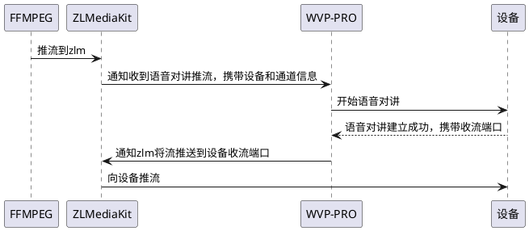
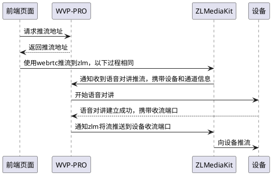

# 原理图

## 使用ffmpeg测试语音对讲原理

```plantuml
@startuml
"FFMPEG" -> "ZLMediaKit": 推流到zlm
"WVP-PRO" <- "ZLMediaKit": 通知收到语音对讲推流，携带设备和通道信息
"WVP-PRO" -> "设备": 开始语音对讲
"WVP-PRO" <-- "设备": 语音对讲建立成功，携带收流端口
"WVP-PRO" -> "ZLMediaKit": 通知zlm将流推送到设备收流端口
"ZLMediaKit" -> "设备": 向设备推流
@enduml
```

## 使用网页测试语音对讲原理

```plantuml
@startuml
"前端页面" -> "WVP-PRO": 请求推流地址
"前端页面" <-- "WVP-PRO": 返回推流地址
"前端页面" -> "ZLMediaKit": 使用webrtc推流到zlm，以下过程相同
"WVP-PRO" <- "ZLMediaKit": 通知收到语音对讲推流，携带设备和通道信息
"WVP-PRO" -> "设备": 开始语音对讲
"WVP-PRO" <-- "设备": 语音对讲建立成功，携带收流端口
"WVP-PRO" -> "ZLMediaKit": 通知zlm将流推送到设备收流端口
"ZLMediaKit" -> "设备": 向设备推流
@enduml
```