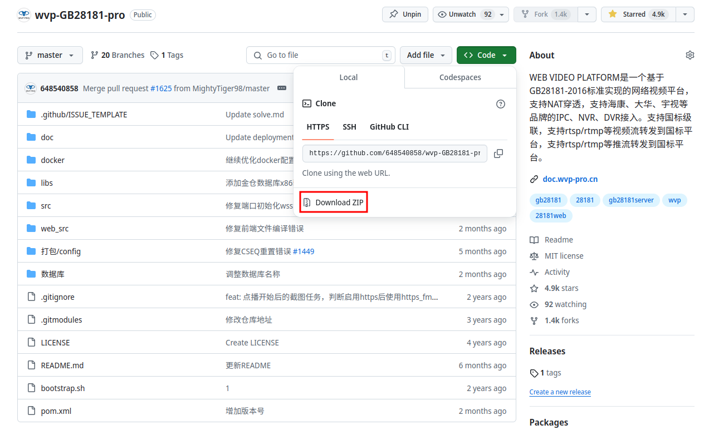
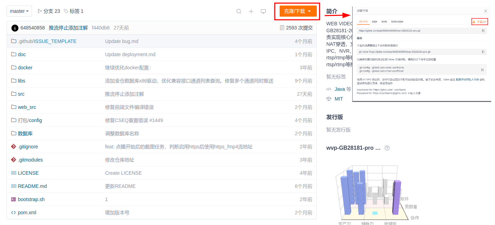
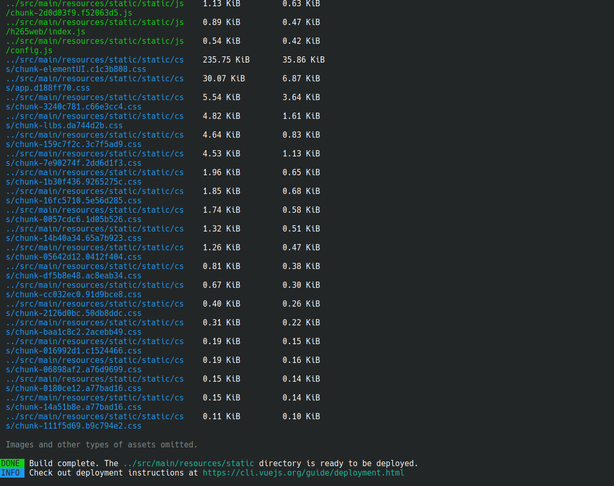

<!-- 编译 -->

# 编译

WVP-PRO不只是实现了国标28181的协议，本身也是一个完整的视频平台。所以对于新手来说，你可能需要一些耐心来完成。遇到问题不要焦躁，你可以

1. 百度
2. 加入星球体提问；[知识星球](https://t.zsxq.com/0d8VAD3Dm)
3. 向作者发送邮件648540858@qq.com,寻求技术支持（有偿）；

WVP-PRO使用Spring boot开发，maven管理依赖。对于熟悉spring开发的朋友是很容易进行编译部署以及运行的。  
下面将提供一种通用方法方便大家运行项目。

## 1 服务介绍

| 服务         | 作用                                       | 是否必须 |
|------------|------------------------------------------|------|
| WVP-PRO    | 实现国标28181的信令以及视频平台相关的功能                  | 是    |
| ZLMediaKit | 为WVP-PRO提供国标28181的媒体部分的实现，以及各种视频流格式的分发支持 | 是    |

## 2 安装依赖

| 依赖     | 版本    | 用途          | 开发环境需要 | 生产环境需要 |
|--------|-------|-------------|--------|--------|
| jdk    | >=1.8 | 运行与编译java代码 | 是      | 是      |  
| maven  | >=3.3 | 管理java代码依赖  | 否      | 否      |
| git    |       | 下载/更新/提交代码  | 否      | 否      |
| nodejs |       | 编译于运行前端文件   | 否      | 否      |
| npm    |       | 管理前端文件依赖    | 否      | 否      |

如果你是一个新手，建议你使用linux或者macOS平台。windows不推荐。

ubuntu环境，以ubuntu 18为例：

``` bash
apt-get install -y openjdk-11-jre git maven nodejs npm
```

centos环境,以centos 8为例：

```bash
yum install -y java-1.8.0-openjdk.x86_64 git maven nodejs npm
```

window环境，以windows10为例：

```bash
这里不细说了，百度或者谷歌一搜一大把，基本都是下一步下一步，然后配置环境变量。
```

## 3 安装mysql以及redis

这里依然是参考网上教程，自行安装吧。

## 4 编译ZLMediaKit

参考ZLMediaKit[WIKI](https://github.com/ZLMediaKit/ZLMediaKit/wiki)
，如果需要使用语音对讲功能，请参考[zlm启用webrtc编译指南](https://github.com/ZLMediaKit/ZLMediaKit/wiki/zlm%E5%90%AF%E7%94%A8webrtc%E7%BC%96%E8%AF%91%E6%8C%87%E5%8D%97)
，开启zlm的webrtc功能。截取一下关键步骤：

```bash
# 国内用户推荐从同步镜像网站gitee下载 
git clone --depth 1 https://gitee.com/xia-chu/ZLMediaKit
cd ZLMediaKit
# 千万不要忘记执行这句命令
git submodule update --init
```

## 5 编译WVP-PRO

### 5.1 可以通过git克隆，也可以在项目下载点击下载



从gitee克隆

```bash
git clone https://gitee.com/pan648540858/wvp-GB28181-pro.git
```

从github克隆

```bash
git clone https://github.com/648540858/wvp-GB28181-pro.git
```

### 5.2 编译前端页面

```shell script
cd wvp-GB28181-pro/web/
npm --registry=https://registry.npmmirror.com install
npm run build:prod
```

编译如果报错, 一般都是网络问题, 导致的依赖包下载失败  
编译完成后在src/main/resources下出现static目录
**编译完成一般是这个样子，中间没有报红的错误信息**


### 5.3 生成可执行jar

```bash
cd wvp-GB28181-pro
mvn package
```

### 5.4 生成war

```bash
cd wvp-GB28181-pro
mvn package -P war
```

编译如果报错, 一般都是网络问题, 导致的依赖包下载失败  
编译完成后在target目录下出现 `wvp-pro-VERSION.jar` 和 `wvp-pro-VERSION.war` 文件。  
接下来[配置服务](./_content/introduction/config.md)

  


