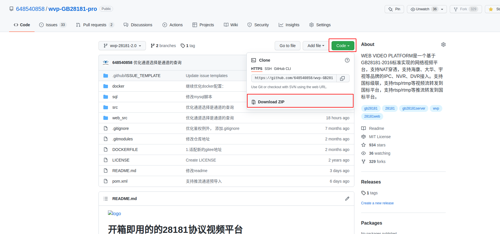
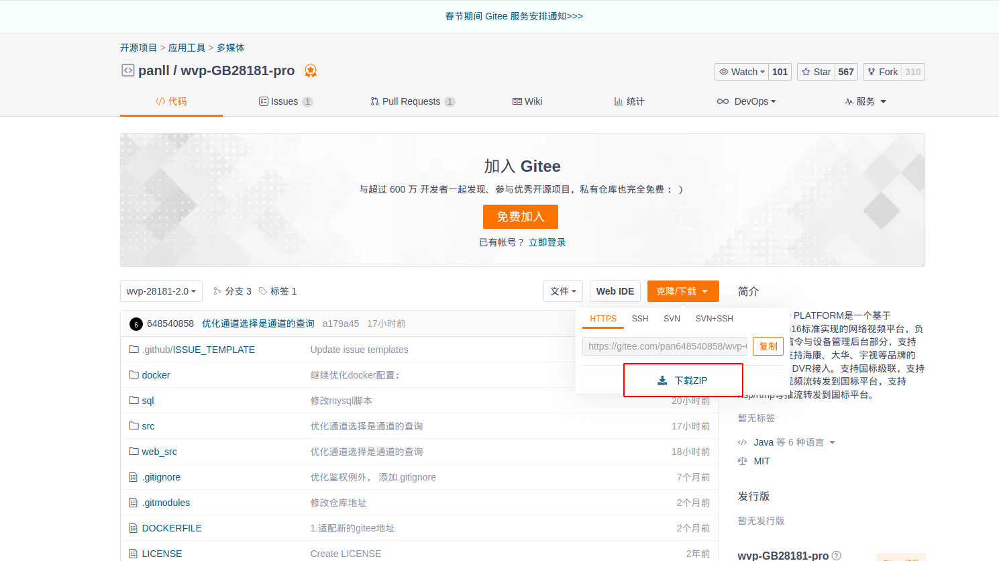
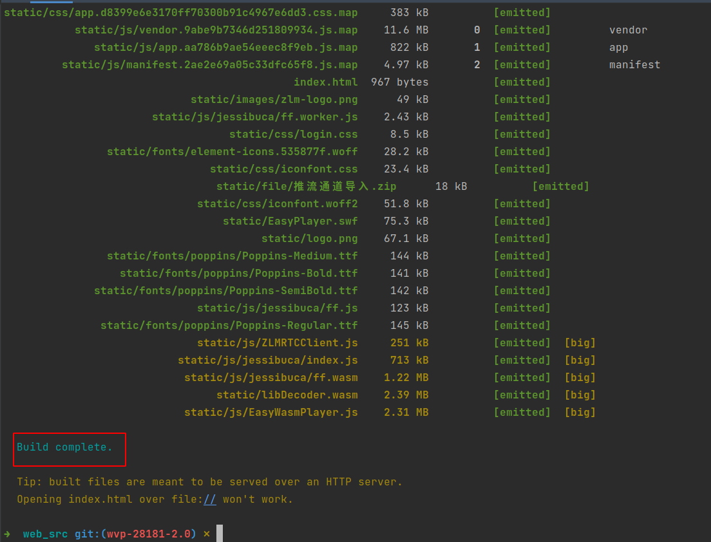

<!-- 编译 -->
# 编译
WVP-PRO不只是实现了国标28181的协议，本身也是一个完整的视频平台。所以对于新手来说，你可能需要一些耐心来完成。遇到问题不要焦躁，你可以
1. 百度
2. 如果身边有熟悉java的朋友，可以咨询下朋友；
3. 来群里（901799015）咨询群友；
4. 向作者发送邮件648540858@qq.com；
5. 作者远程支持（有偿）。   
   如果这些仍不能解决你的问题，那么你可能需要与作者我一起合作完成这个项目，解决你遇到的问题。


WVP-PRO使用Spring boot开发，maven管理依赖。对于熟悉spring开发的朋友是很容易进行编译部署以及运行的。  
下面将提供一种通用方法方便大家运行项目。
## 1 服务介绍
| 服务             | 作用                                       | 是否必须                    |
|----------------|------------------------------------------|-------------------------|
| WVP-PRO        | 实现国标28181的信令以及视频平台相关的功能                  | 是                       |
| ZLMediaKit     | 为WVP-PRO提供国标28181的媒体部分的实现，以及各种视频流格式的分发支持 | 是                       |
| wvp-pro-assist | wvp的辅助录像程序，也可单独跟zlm一起使用，提供录像控制,录像合并下载接口  | 否（不安装只是影响云端录像功能和国标录像下载） |

## 2 安装依赖
| 依赖     | 版本         | 用途          | 开发环境需要 | 生产环境需要 |
|--------|------------|-------------|--------|--------|
| jdk    | >=1.8      | 运行与编译java代码 | 是      | 是      |  
| maven  | >=3.3      | 管理java代码依赖  | 否      | 否      |
| git    || 下载/更新/提交代码 | 否           | 否      |
| nodejs || 编译于运行前端文件  | 否           | 否      |
| npm    || 管理前端文件依赖   | 否           | 否      |

如果你是一个新手，建议你使用linux或者macOS平台。windows不推荐。

ubuntu环境，以ubuntu 18为例：
``` bash
apt-get install -y openjdk-11-jre git maven nodejs npm
```
centos环境,以centos 8为例：
```bash
yum install -y java-1.8.0-openjdk.x86_64 git maven nodejs npm
```
window环境，以windows10为例：
```bash
这里不细说了，百度或者谷歌一搜一大把，基本都是下一步下一步，然后配置环境变量。
```
## 3 安装mysql以及redis
这里依然是参考网上教程，自行安装吧。

## 4 编译ZLMediaKit
参考ZLMediaKit[WIKI](https://github.com/ZLMediaKit/ZLMediaKit/wiki)，截取一下关键步骤：
```bash
# 国内用户推荐从同步镜像网站gitee下载 
git clone --depth 1 https://gitee.com/xia-chu/ZLMediaKit
cd ZLMediaKit
# 千万不要忘记执行这句命令
git submodule update --init
```
## 5 编译WVP-PRO
### 5.1 可以通过git克隆，也可以在项目下载点击下载


从gitee克隆
```bash
git clone https://gitee.com/pan648540858/wvp-GB28181-pro.git
```
从github克隆
```bash
git clone https://github.com/648540858/wvp-GB28181-pro.git
```

### 5.2 编译前端页面
```shell script
cd wvp-GB28181-pro/web_src/
npm --registry=https://registry.npm.taobao.org install
npm run build
```
编译如果报错, 一般都是网络问题, 导致的依赖包下载失败  
编译完成后在src/main/resources下出现static目录
**编译完成一般是这个样子，中间没有报红的错误信息**


### 5.3 打包项目, 生成可执行jar
```bash
cd wvp-GB28181-pro
mvn package
```
编译如果报错, 一般都是网络问题, 导致的依赖包下载失败  
编译完成后在target目录下出现wvp-pro-***.jar。  
接下来[配置服务](./_content/introduction/config.md)

  


