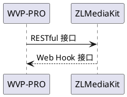

<!-- 配置 -->

# 配置

对于首次测试或者新手同学，我建议在局域网测试，并且关闭服务器与客户机的防火墙测试。建议部署在linux进行测试。



WVP-PRO通过调用ZLMediaKit的RESTful接口实现对ZLMediaKit行为的控制; ZLMediaKit通过Web Hook 接口把消息通知WVP-PRO。通过这种方式，实现了两者的互通。
对于最简单的配置，你不需要修改ZLMediaKit的任何默认配置。你只需要在WVP-PRO中配置的ZLMediaKit信息即可

## 1 WVP配置文件位置

基于spring boot的开发方式，配置文件的加载是很灵活的。默认在src/main/resources/application.yml，部分配置项是可选，你不需要全部配置在配置文件中，
完全的配置说明可以参看"src/main/resources/配置详情.yml"。

### 1.1 默认加载配置文件方式

使用maven打包后的target里，已经存在了配置文件，默认加载配置文件为application.yml，查看内容发现其中spring.profiles.active配置的内容，将入配置的值为dev，那么具体加载的配置文件就是application-dev.yml，如果配置的值找不到对应的配置文件，修改值为dev。

```shell
cd wvp-GB28181-pro/target
java -jar wvp-pro-*.jar
```

## 2 配置WVP-PRO

wvp支持多种数据库，包括Mysql，Postgresql，金仓等，配置任选一种即可。

### 2.1 数据库配置

#### 2.1.1 初始化数据库

首先使用创建数据库，然后使用sql/初始化.sql初始化数据库，如果是从旧版升级上来的，使用升级sql更新。

#### 2.1.2 Mysql数据库配置

数据库名称以wvp为例

```yaml
spring:
  datasource:
    type: com.zaxxer.hikari.HikariDataSource
    driver-class-name: com.mysql.cj.jdbc.Driver
    url: jdbc:mysql://127.0.0.1:3306/wvp?useUnicode=true&characterEncoding=UTF8&rewriteBatchedStatements=true&serverTimezone=PRC&useSSL=false&allowMultiQueries=true
    username: root
    password: root123
```

#### 2.1.3 Postgresql数据库配置

数据库名称以wvp为例

```yaml
spring:
  datasource:
    type: com.zaxxer.hikari.HikariDataSource
    driver-class-name: org.postgresql.Driver
    url: jdbc:postgresql://127.0.0.1:3306/wvp?useUnicode=true&characterEncoding=UTF8&rewriteBatchedStatements=true&serverTimezone=PRC&useSSL=false&allowMultiQueries=true&allowPublicKeyRetrieval=true
    username: root
    password: 12345678

pagehelper:
  helper-dialect: postgresql
```

#### 2.1.4 金仓数据库配置

数据库名称以wvp为例

```yaml
spring:
  datasource:
    type: com.zaxxer.hikari.HikariDataSource
    driver-class-name: com.kingbase8.Driver
    url: jdbc:kingbase8://127.0.0.1:3306/wvp?useUnicode=true&characterEncoding=utf8
    username: root
    password: 12345678
    

pagehelper:
  helper-dialect: postgresql
```

### 2.2 Redis数据库配置

配置wvp中的redis连接信息，建议wvp自己单独使用一个db。

### 2.3 配置服务启动端口（可直接使用默认配置）

```yaml
# [可选] WVP监听的HTTP端口, 网页和接口调用都是这个端口
server:
  port: 18080
```

### 2.4 配置28181相关信息（可直接使用默认配置）

```yaml
# 作为28181服务器的配置
sip:
  # [可选] 28181服务监听的端口
  port: 5060
  # 根据国标6.1.2中规定，domain宜采用ID统一编码的前十位编码。国标附录D中定义前8位为中心编码（由省级、市级、区级、基层编号组成，参照GB/T 2260-2007）
  # 后两位为行业编码，定义参照附录D.3
  # 3701020049标识山东济南历下区 信息行业接入
  # [可选]
  domain: 3402000000
  # [可选]
  id: 34020000002000000001
  # [可选] 默认设备认证密码，后续扩展使用设备单独密码, 移除密码将不进行校验
  password: 12345678
```

### 2.5 配置ZLMediaKit连接信息

```yaml
#zlm 默认服务器配置
media:
  id: zlmediakit-local
  # [必须修改] zlm服务器的内网IP
  ip: 172.19.128.50
  # [可选] 有公网IP就配置公网IP, 不可用域名
  wan_ip:
  # [必须修改] zlm服务器的http.port
  http-port: 9092
  # [可选] zlm服务器访问WVP所使用的IP, 默认使用127.0.0.1，zlm和wvp没有部署在同一台服务器时必须配置
  hook-ip: 172.19.128.50
  # [必选选] zlm服务器的hook.admin_params=secret
  secret: TWSYFgYJOQWB4ftgeYut8DW4wbs7pQnj
  # 启用多端口模式, 多端口模式使用端口区分每路流，兼容性更好。 单端口使用流的ssrc区分， 点播超时建议使用多端口测试
  rtp:
    # [可选] 是否启用多端口模式, 开启后会在portRange范围内选择端口用于媒体流传输
    enable: true
    # [可选] 在此范围内选择端口用于媒体流传输, 必须提前在zlm上配置该属性，不然自动配置此属性可能不成功
    port-range: 30000,35000 # 端口范围
    # [可选] 国标级联在此范围内选择端口发送媒体流,
    send-port-range: 40000,40300 # 端口范围
```

### 2.4 策略配置

```yaml
# [根据业务需求配置]
user-settings:
  # 点播/录像回放 等待超时时间,单位：毫秒
  play-timeout: 180000
  # [可选] 自动点播， 使用固定流地址进行播放时，如果未点播则自动进行点播, 需要rtp.enable=true
  auto-apply-play: true
  # 推流直播是否录制
  record-push-live: true
  # 国标是否录制
  record-sip: true
  # 国标点播 按需拉流, true：有人观看拉流，无人观看释放， false：拉起后不自动释放
  stream-on-demand: true
```

更多完整的配置信息参考"src/main/resources/配置详情.yml"文件，需要那个配置项，复制到正在使用的配置文件中对应的文件即可。

如果配置信息无误，你可以启动zlm，再启动wvp来测试了，启动成功的话，你可以在wvp的日志下看到zlm已连接的提示。
接下来[部署到服务器](./_content/introduction/deployment.md)， 如果你只是本地运行直接在本地运行即可。
