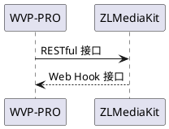

<!-- 配置 -->
# 配置
对于首次测试或者新手同学，我建议在局域网测试，并且关闭服务器与客户机的防火墙测试。建议部署在linux进行测试。


WVP-PRO通过调用ZLMediaKit的RESTful接口实现对ZLMediaKit行为的控制; ZLMediaKit通过Web Hook 接口把消息通知WVP-PRO。通过这种方式，实现了两者的互通。
对于最简单的配置，你不需要修改ZLMediaKit的任何默认配置。你只需要在WVP-PRO中配置的ZLMediaKit信息即可
## 1 WVP配置文件位置
基于spring boot的开发方式，配置文件的加载是很灵活的。默认在src/main/resources/application.yml，部分配置项是可选，你不需要全部配置在配置文件中，
完全的配置说明可以参看all-application.yml。
### 1.1 默认加载配置文件方式
使用maven打包后的jar包里，已经存在了配置文件，但是每次打开jar包修改配置文件或者修改后再打包都是比较麻烦的，所以大家可通过指定配置文件路径来加载指定位置的配置文件。
```shell
cd wvp-GB28181-pro/target
java -jar wvp-pro-*.jar --spring.config.location=../src/main/resources/application.yml
```
### 1.2 迁移配置文件以方便启动
由于配置文件的命令比较长，所以为了启动方便通常我会把配置文件放到jar包的同级目录，类似这样,
移除jar包内/BOOT-INF/classes/下所有以application开头的文件，使用解压缩工具打开jar即可，不需要解压出来。
```shell
cd wvp-GB28181-pro/target
mv ../src/main/resources/application-dev.yml application.yml 
java -jar wvp-pro-*.jar 
```
这也是我自己最常用的方式。
## 2 配置WVP-PRO
### 2.1 Mysql数据库配置
首先你需要创建一个名为wvp（也可使用其他名字）的数据库，并使用sql/mysql.sql导入数据库，初始化数据库结构。
在application-dev.yml中配置（使用1.2方式的是在jar包的同级目录的application.yml）配置数据库连接，包括数据库连接信息，密码。
### 2.2 Redis数据库配置
配置wvp中的redis连接信息，建议wvp自己单独使用一个db。
### 2.3 配置服务启动端口（可直接使用默认配置）
```yaml
# [可选] WVP监听的HTTP端口, 网页和接口调用都是这个端口
server:
    port: 18080
```
### 2.4 配置28181相关信息（可直接使用默认配置）
```yaml
# 作为28181服务器的配置
sip:
    # [必须修改] 本机的IP
    ip: 192.168.1.3
    # [可选] 28181服务监听的端口
    port: 5060
    # 根据国标6.1.2中规定，domain宜采用ID统一编码的前十位编码。国标附录D中定义前8位为中心编码（由省级、市级、区级、基层编号组成，参照GB/T 2260-2007）
    # 后两位为行业编码，定义参照附录D.3
    # 3701020049标识山东济南历下区 信息行业接入
    # [可选]
    domain: 3402000000
    # [可选]
    id: 34020000002000000001
    # [可选] 默认设备认证密码，后续扩展使用设备单独密码, 移除密码将不进行校验
    password: 12345678
```
### 2.5 配置ZLMediaKit连接信息
```yaml
#zlm 默认服务器配置
media:
    # ZLMediaKit的服务ID，必须配置
    id: FQ3TF8yT83wh5Wvz
    # [必须修改] zlm服务器的内网IP，sdp-ip与stream-ip使用默认值的情况下，这里不要使用127.0.0.1/0.0.0.0
    ip: 192.168.1.3
    # [必须修改] zlm服务器的http.port
    http-port: 6080
    # [可选] zlm服务器的hook.admin_params=secret
    secret: 035c73f7-bb6b-4889-a715-d9eb2d1925cc
    # 启用多端口模式, 多端口模式使用端口区分每路流，兼容性更好。 单端口使用流的ssrc区分， 点播超时建议使用多端口测试
    rtp:
        # [可选] 是否启用多端口模式, 开启后会在portRange范围内选择端口用于媒体流传输
        enable: true
        # [可选] 在此范围内选择端口用于媒体流传输,
        port-range: 30000,30500 # 端口范围
        # [可选] 国标级联在此范围内选择端口发送媒体流,
        send-port-range: 30000,30500 # 端口范围
    # 录像辅助服务， 部署此服务可以实现zlm录像的管理与下载， 0 表示不使用
    record-assist-port: 18081
```
### 2.4 个性化定制信息配置
```yaml
# [根据业务需求配置]
user-settings:
    # [可选] 服务ID，不写则为000000
    server-id:
    # [可选] 自动点播， 使用固定流地址进行播放时，如果未点播则自动进行点播, 需要rtp.enable=true
    auto-apply-play: false
    # [可选] 部分设备需要扩展SDP，需要打开此设置
    senior-sdp: false
    # 保存移动位置历史轨迹：true:保留历史数据，false:仅保留最后的位置(默认)
    save-position-history: false
    # 点播等待超时时间,单位：毫秒
    play-timeout: 3000
    # 等待音视频编码信息再返回， true： 可以根据编码选择合适的播放器，false： 可以更快点播
    wait-track: false
    # 是否开启接口鉴权
    interface-authentication: true
    # 自动配置redis 可以过期事件
    redis-config: true
    # 接口鉴权例外的接口, 即不进行接口鉴权的接口,尽量详细书写，尽量不用/**，至少两级目录
    interface-authentication-excludes:
        - /api/v1/**
    # 推流直播是否录制
    record-push-live: true
    # 国标是否录制
    record-sip: true
    # 是否将日志存储进数据库
    logInDatebase: true
    # 第三方匹配，用于从stream钟获取有效信息
    thirdPartyGBIdReg: [\s\S]*
```


如果配置信息无误，你可以启动zlm，再启动wvp来测试了，启动成功的话，你可以在wvp的日志下看到zlm已连接的提示。
接下来[部署到服务器](./_content/introduction/deployment.md)， 如何你只是本地运行直接再本地运行即可。