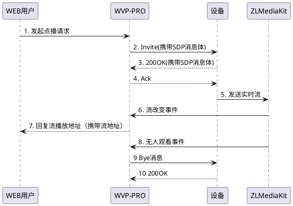
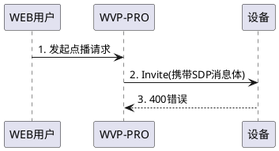

<!-- 点播错误 -->
# 点播错误
排查点播错误你首先要清楚[点播的基本流程](_content/theory/play.md),一般的流程如下：

针对几种常见的错误，我们来分析一下，也方便大家对号入座解决常见的问题
## 点播收到错误码
这个错误一般表现为点击"播放"按钮后很快得到一个错误。
1. **400错误码**  
出现400错误玛时一般是这样的流程是这样的

此时通常是设备认为WVP发送了错误的消息给它，它认为消息不全或者错误所以直接返回400错误，此时我们需要[抓包](_content/skill/tcpdump.md)来分析是否缺失了内容，也可以直接联系对方询问为什么返回了400。
WVP不能保证兼容所有的设备，有些实现不规范的设备可能在对接时就会出现上述问题，你可以联系作者帮忙对接。
2. **500错误码**  
500或者大于500小于600的错误码一般多是设备内部出了问题，解决方式有两个，第一种直接联系设备/平台客服寻求解决；第二种，如果你有确定可以对接这个设备的平台那么可以把对接这个平台的抓包和对接wvp的抓包同时发送给我，我来尝试解决。

## 点播超时
点播超时的情况大致分为两种：点播超时和收流超时
1. **点播超时**  
点播超时错误一般为信令的超时，比如长时间为收到对方的回复，可能出现在流程中 “3. 200OK(携带SDP消息体)”这个位置，即我们发送点播消息，但是设备没有回复，可能的原因：
> 1. 设备内部错误，未能回复消息
> 2. 网络原因消息未到到达设备  

大部分时候是原因2，所以遇到这个错误我们首先要排查我们我的网路，如果你是公网部署，那么也可能时心跳周期太长，导致的路由NAT失效，WVP的消息无法通道原来的IP端口号发送给设备。

2. **收流超时**  
收流超时可能发生在流程中的5和6,可能的原因有：
> 1. 设备发送了流但是发送到了错误的ip和端口上，而这个信息是在invite消息的sdp中指定的，就是流程2Invite(携带SDP消息体)中，而这个错误很可能来自你的配置错误，比如你设置了127.0.0.1导致设备网127.0.0.1上发流，或者是你WVP在公网，但是你给设备了一个内网ip，导致设备无法把流发送过来；
> 2. 设备内部错误未发送流；
> 2. 设备发送了流，但是流无法识别，可能存在于流不规范和网络很差的情况下；
> 3. 设备发送了流，zlm也收到了，但是zlm无法通过hook通知到wvp，此时原因是你可以检查zlm的配置文件中的hook配置，看看是否无法从zlm连接到wvp；
> 4. 设备发送了流，但是开启SSRC校验，设备的流不够规范采用错误的ssrc，导致zlm选择丢弃；
 
针对这些可能的错误原因我建议的排查顺序：  
- 关闭ssrc校验；
- 查看zlm配置的hook是否可以连接到zlm；
- 查看zlm日志是否有流注册；
- 抓包查看流的信息，看看流是否正常发送，甚至可以导出发送原始流，用vlc播放，看看是否可以播放。
