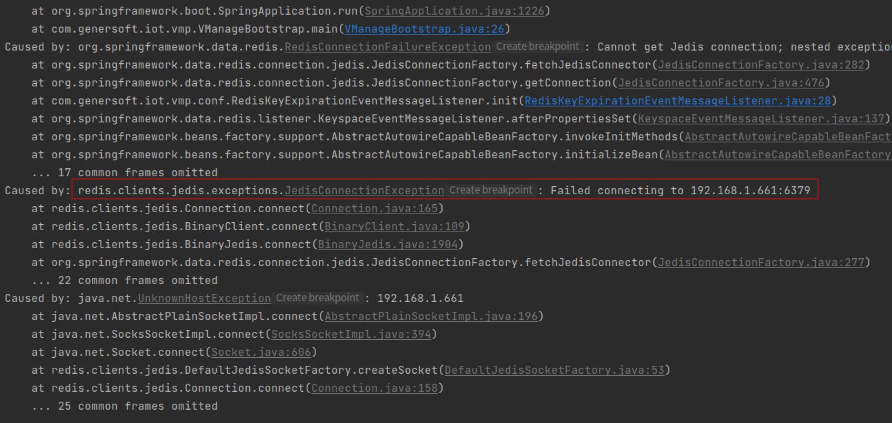
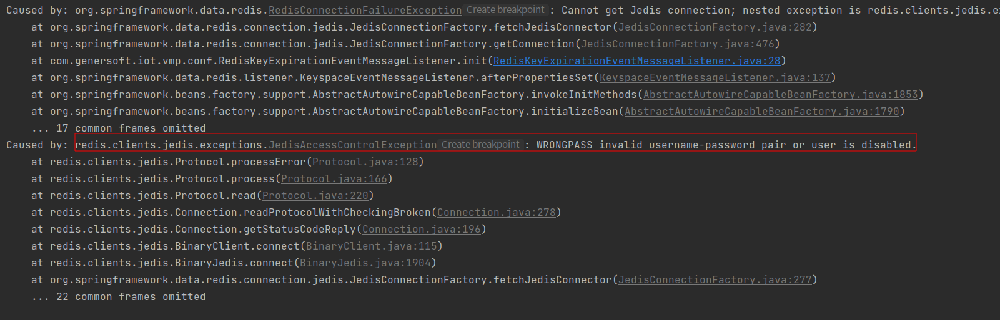
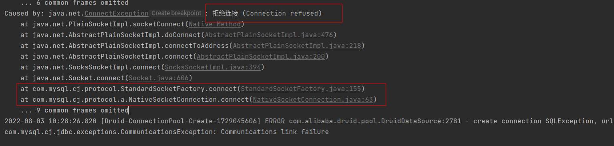
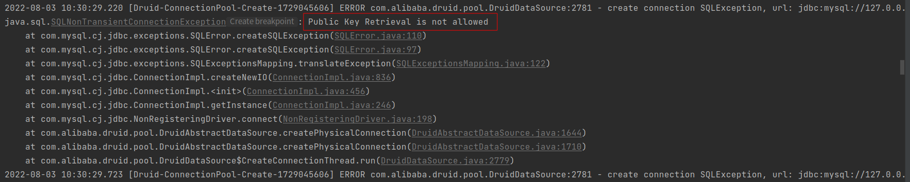
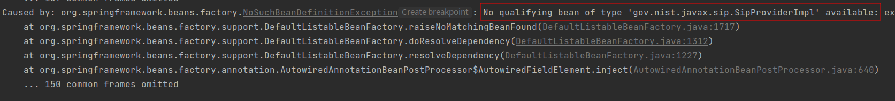
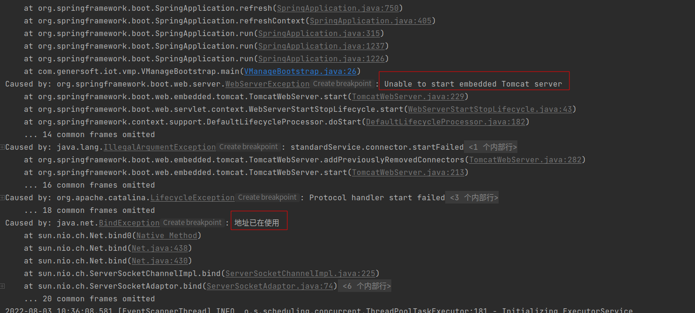

<!-- 启动时报错 -->
# 启动时报错
启动时的报错大部分时候是因为你的配置有问题，比如mysql没连接上，redis没连接上，18080/15060端口占用了，这些都会导致启动是报错，修改配置配置之后都可以解决；
下面我整理的一些常见的错误，大家可以先对号入座的简单排查下。
> **常见错误**  

**错误原因：** redis配置错误，可能原因： redis未启动/ip错误/端口错误/网络不通  
---

**错误原因：** redis配置错误，可能原因： 密码错误
---

**错误原因：** mysql配置错误，可能原因： mysql未启动/ip错误/端口错误/网络不通  
---

**错误原因：** mysql配置错误，可能原因： 用户名/密码错误
---

**错误原因：** SIP配置错误，可能原因： SIP端口被占用
---

**错误原因：** WVP Tomcat端口配置错误，可能原因： server.port端口被占用
---