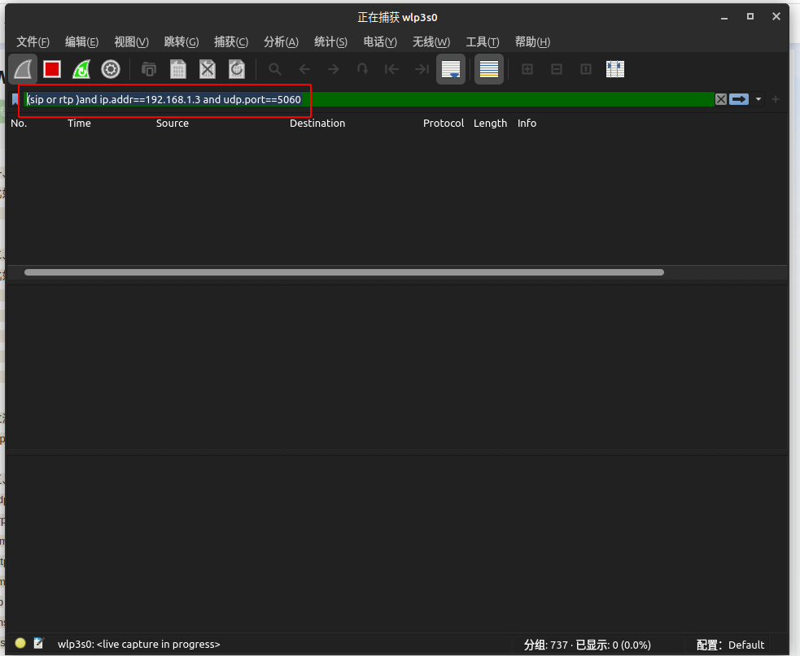
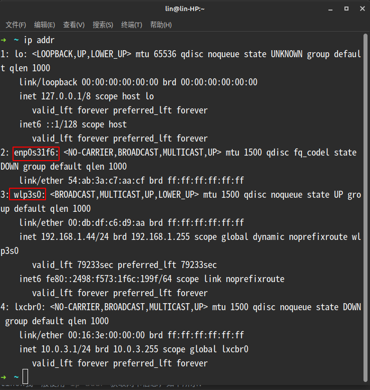
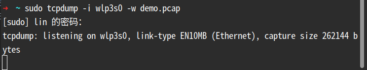

<!-- 抓包 -->
# 抓包
如果说对于网络编程，有什么工具是必会的，我觉得抓包肯定是其中之一了。作为GB/T 28181调试过程中最重要的手段，我觉得如果你真对他有兴趣，或者系统遇到问题可以最快的得到解决，那么抓包你就一定要学会了。

## 抓包工具的选择
### 1. Wireshark
在具备图形界面的系统上，比如windows，linux发行版ubuntu，opensuse等，我一般直接使用Wireshark直接进行抓包，也方便进行内容的查看。
### 2. Tcpdump
在使用命令行的系统，比如linux服务器，我一般使用Tcpdump进行抓包，无需额外安装，系统一般自带，抓包的到的文件，可以使用Wireshark打开，在图形界面下方便查看内容。

## 工具安装
Wireshark的安装很简单，根据提示一步步点击就好了，在linux需要解决权限的问题，如果和我一样使用图形界面的linux发行版的话，可以参看如下步骤; windows的小伙伴直接略过即可
```shell
# 1. 添加wireshark用户组
sudo groupadd wireshark
# 2. 将dumpcap更改为wireshark用户组
sudo chgrp wireshark /usr/bin/dumpcap
# 3. 让wireshark用户组有root权限使用dumpcap
sudo chmod 4755 /usr/bin/dumpcap
# 4. 将需要使用的用户名加入wireshark用户组
sudo gpasswd -a $USER wireshark
```
tcpdump一般linux都是自带，无需安装，可以这样验证;显示版本信息即是已安装
```shell
tcpdump --version
```
## 开始抓包
### 使用Wireshark
在28181中我一般只关注sip包和rtp包，所以我一般是直接过滤sip和rtp，可以输入框输入 `sip or rtp`这样即可，如果设备来源比较多还可以加上ip和端口号的过滤`(sip or rtp )and ip.addr==192.168.1.3 and udp.port==5060`
详细的过滤规则可以自行百度，我可以提供一些常用的给大家参考
  
**只过滤SIP：**
```shell
sip
```
**只获取rtp数据：**
```shell
rtp
```
**默认方式：**
```shell
sip or rtp
```
**过滤IP：**
```shell
 sip and ip.addr==192.168.1.3
```
**过滤端口：**
```shell
 sip and udp.port==5060
```
输入命令开启抓包后，此时可以进行操作，比如点播，录像回访等，操作完成回到Wireshark点击红色的停止即可，需要保存文件可以点击`文件->导出特定分组`导出过滤后的数据，也可以直接`文件->另存为`保存未过滤的数据。
### 使用tcpdump
对于服务器抓包，为了得到足够完整的数据，我一般会要求直接抓取网卡数据而不过滤，如下：
抓取网卡首先需要获取网卡名，在linux我一般使用`ip addr`获取网卡信息，如下所示：

```shell
sudo tcpdump -i wlp3s0 -w demo.pcap
```
  
命令行会停留在这个位置，此时可以进行操作，比如点播，录像回放等，操作完成回到命令行使用`Ctrl+C`结束命令行，在当前目录下得到demo.pcap，将这个文件下载到图形界面操作系统里，即可使用Wireshark查看了
更多的操作可以参考： [https://www.cnblogs.com/jiujuan/p/9017495.html](https://www.cnblogs.com/jiujuan/p/9017495.html)
