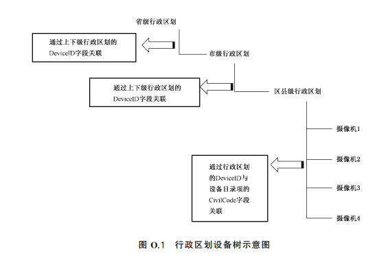
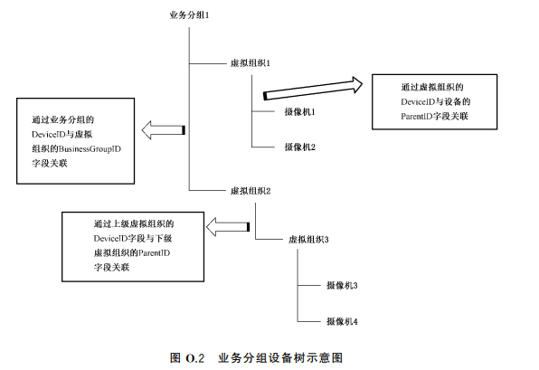

<!-- 通道的树形结构 -->

# 通道的树形结构

国标28181规定了两种组织设备树的方式
1. **行政区划**  
   行政区划模式下主要是以行政区划作为目录节点例如：河北省->邯郸市->广平县  
     
2. **业务分组**  
   业务分组主要自定义的目录树的一种组织形式，但是对定义的目录的国标编号有一定的要求。  
   第一级别需要是业务分组类型，即国标编码中的11、12、13是215,例如：65010200002150000001；  
   业务分组下是虚拟组织，即国标编码中的11、12、13是216,例如：65010200002160000002。  
   虚拟组织下不可是业务分组，虚拟组织下可以继续添加虚拟组织。  
   
