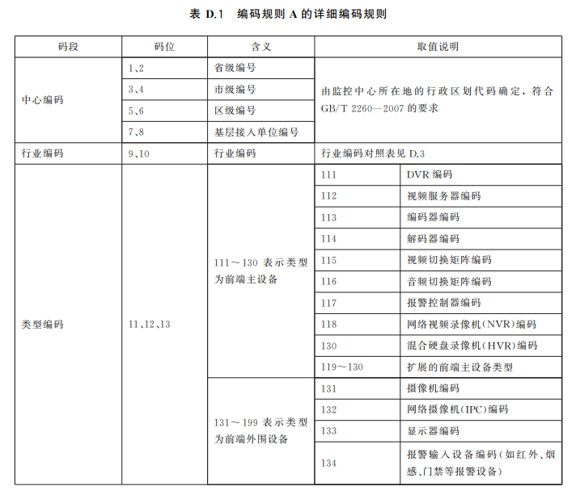
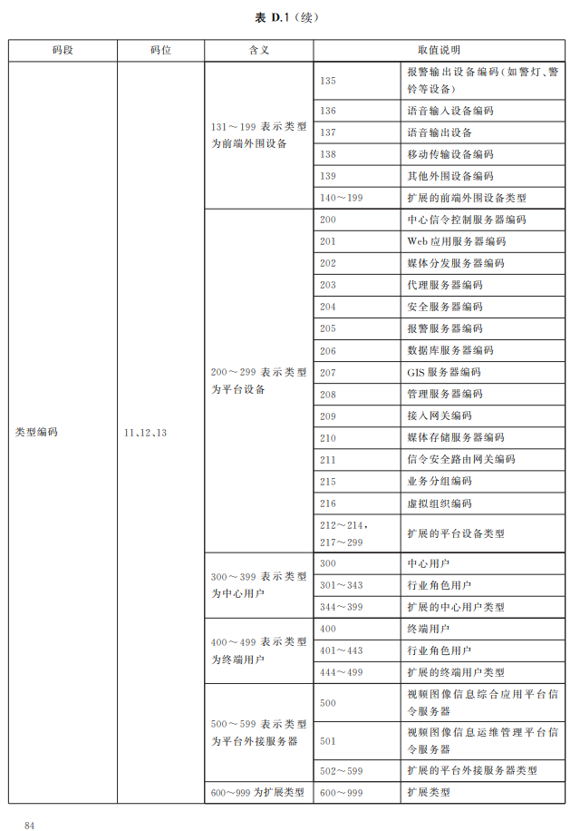
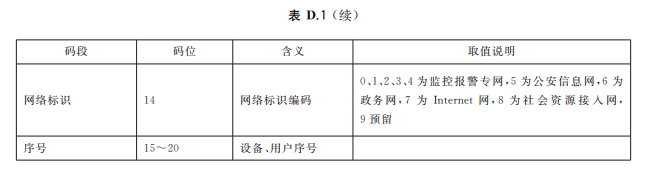
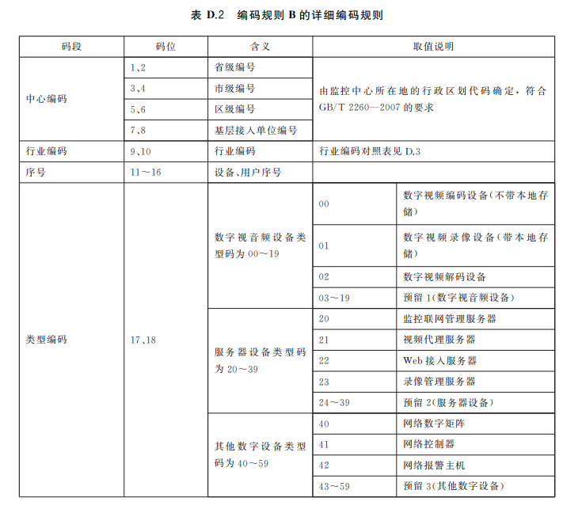
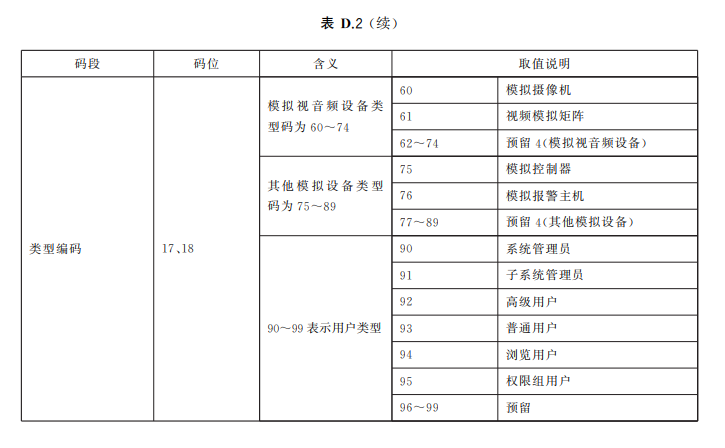
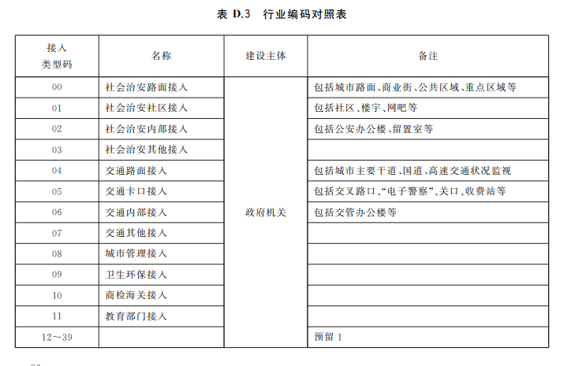
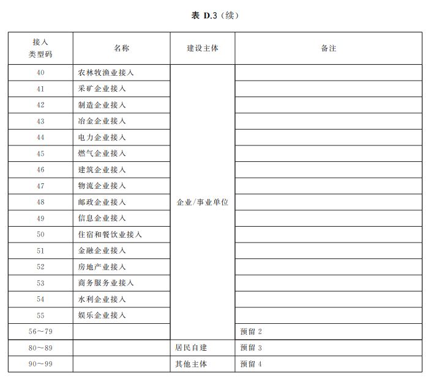

<!-- 统一编码规则 -->

# 统一编码规则
## D.1 编码规则 A
>&emsp;&emsp;编码规则 A 由中心编码(8位)、行业编码(2位)、类型编码(3位)和序号(7位)四个码段共20位十
>进制数字字符构成,即系统编码 =中心编码 + 行业编码 + 类型编码 + 序号。  
>&emsp;&emsp;编码规则 A 的详细说明见表 D.1。其中,中心编码指用户或设备所归属的监控中心的编码,按照监控中心所在地的行政区划代码确定,
> 当不是基层单位时空余位为0。行政区划代码采用 GB/T2260— 2007规定的行政区划代码表示。行业编码是指用户或设备所归属的行业,行业编码对照表见 D.3。
> 类型编码指定了设备或用户的具体类型,其中的前端设备包含公安系统和非公安系统的前端设备,终端用 户包含公安系统和非公安系统的终端用户。   

  

## D.2 编码规则 B
>&emsp;&emsp;编码规则 B由中心编码(8位)、行业编码(2位)、序号(4位)和类型编码(2位)四个码段构成,即系
>统编码 =中心编码 + 行业编码 +序号+类型编码。编码规则 B的详细说明见表 D.2。

## D.3 行业编码对照表
>&emsp;&emsp;行业编码对照表见表 D.3。  

