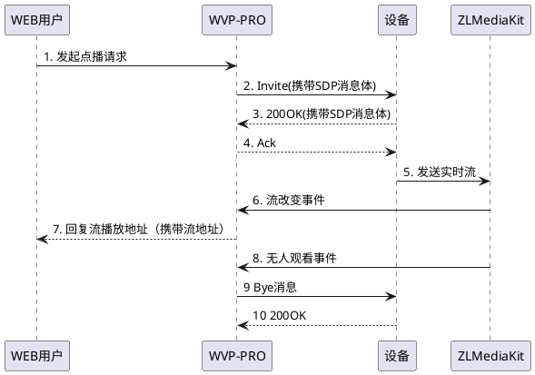

<!-- 点播流程 -->

# 点播流程
> 以下为WVP-PRO点播流程。点播成功前的任何一个环节出现问题都可能出现点播超时，这也是排查点播超时的依据。

##  注册流程描述如下:  
1. 用户从网页或调用接口发起点播请求;  
2. WVP-PRO向摄像机发送Invite消息,消息头域中携带 Subject字段,表明点播的视频源ID、发送方媒体流序列号、ZLMediaKit接收流使用的IP、端口号、
 接收端媒体流序列号等参数,SDP消息体中 s字段为“Play”代表实时点播，y字段描述SSRC值,f字段描述媒体参数。
3. 摄像机向WVP-PRO回复200OK，消息体中描述了媒体流发送者发送媒体流的IP、端口、媒体格式、SSRC字段等内容。
4. WVP-PRO向设备回复Ack， 会话建立成功。
5. 设备向ZLMediaKit发送实时流。
6. ZLMediaKit向WVP-PRO发送流改变事件。
7. WVP-PRO向WEB用户回复播放地址。
8. ZLMediaKit向WVP发送流无人观看事件。
9. WVP-PRO向设备回复Bye， 结束会话。
10. 设备回复200OK，会话结束成功。
