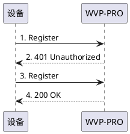

<!-- 注册流程 -->

# 注册流程
WVP-PRO目前仅支持国标中描述的基本注册流程，也是最常用的，
> 基本注册即采用IETFRFC3261规定的基于数字摘要的挑战应答式安全技术进行注册.

> 注册流程描述如下:  
> 1. 摄像机向WVP-PRO服务器发送 Register请求;  
> 2. WVP-PRO向摄像机发送响应401,并在响应的消息头 WWW_Authenticate字段中给出适合摄像机的认证体制和参数;
> 3. 摄像机重新向WVP-PRO发送 Register请求,在请求的 Authorization字段给出信任书, 包含认证信息;
> 4. WVP-PRO对请求进行验证,如果检查出 摄像机身份合法,向摄像机发送成功响应 200OK,如果身份不合法则发送拒绝服务应答。
