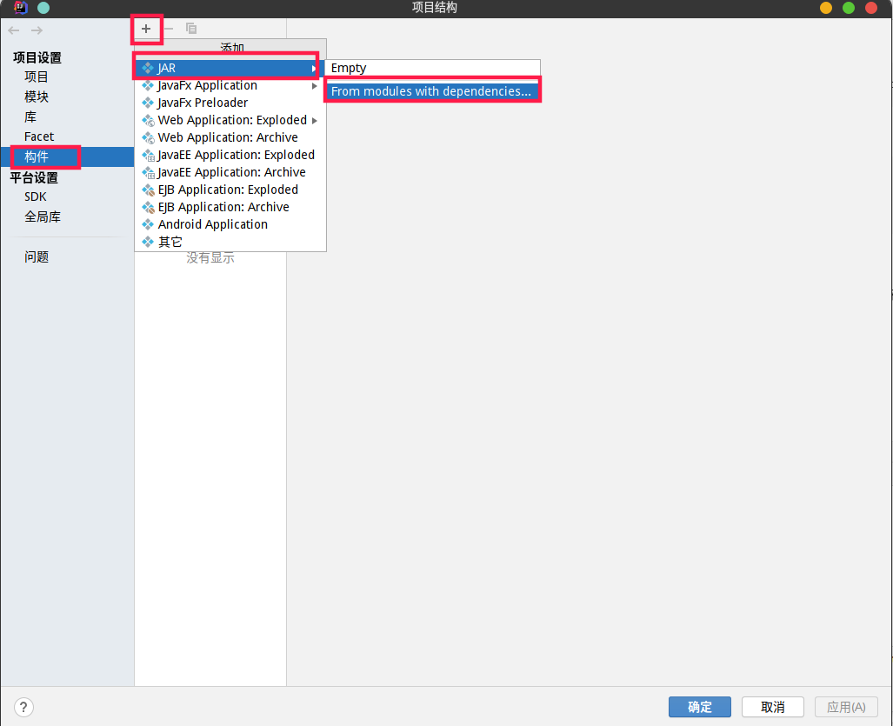
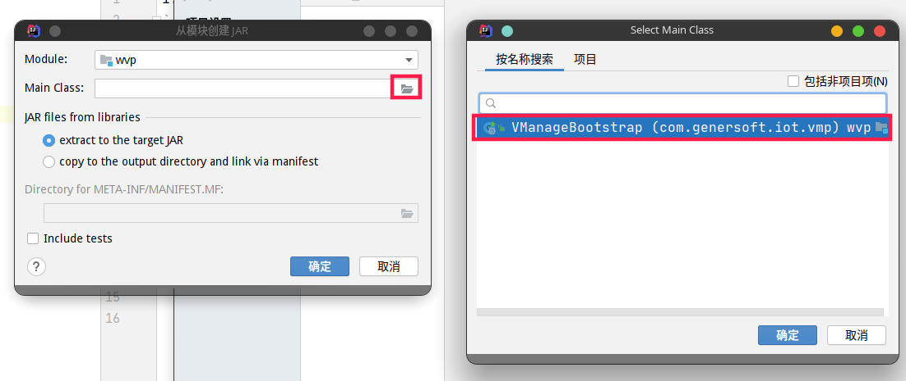
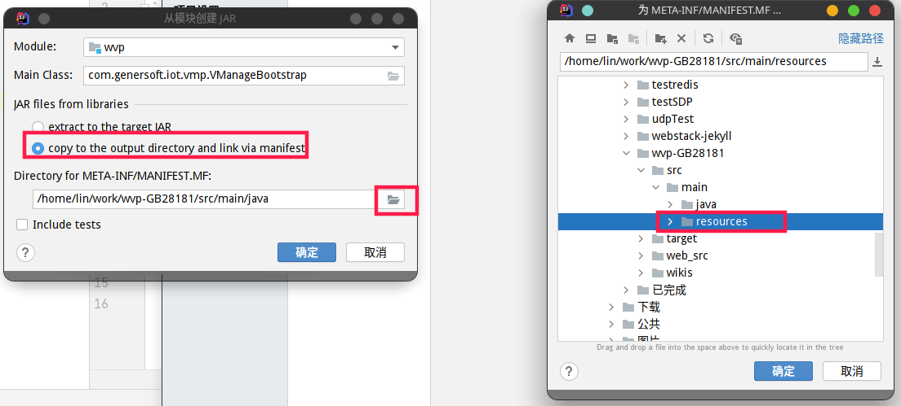
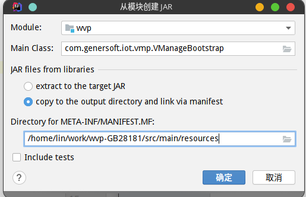

1. 检出代码
```shell script
git clone https://github.com/648540858/wvp-GB28181.git
```
2. 编译静态页面
```shell script
cd wvp-GB28181/web_src
npm install
npm run build
```
在src/main/resources/static下出现静态文件
3. 编译JAVA项目
打包过程同普通Spring Boot项目打包.
在IDEA下,文件->打开, 找到克隆的项目.




